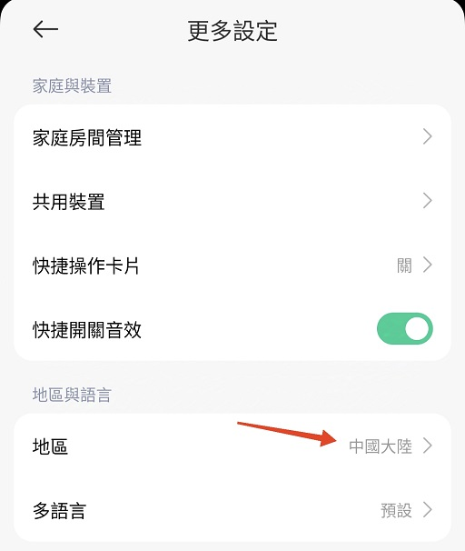
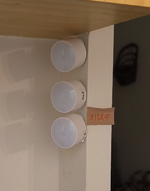
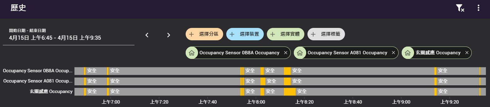

[🧾去選單](../../README.md)

> 發布於: 2025/4/17

# 居家Bluetooth系列：小米電池人在感應器（2025）

> 2025年最新重製版

## 目錄

- [快速總結](#快速總結)
- [優點](#-優點)
- [缺點](#-缺點)
- [正文](#正文開始)
- [更換電池教學](#如何更換電池)
- [接入HA教學](#從零開始接入HA)
- [穩定性測試](#穩定性測試)

## 快速總結

- 目前體驗良好的小米電池人在感應器
- 結合紅外線、微波雷達、光照度感應器
- 電池供電，無須走線，設置地點大解放！
- 淘寶售價約人民幣120 (台幣550)
- 採用`CR2450` (注意不是CR2032)
- 標稱續航3年 (有但書下面說明)
- 安裝地點避開經常有人的空間避免加速耗電
- 安裝地點避開風吹、震動干擾源

### 👍 優點

#### 標稱3年續航力

為提高續航力而採用`CR2450`大顆鈕扣電池。

> 請注意並非是小型的CR2032鈕扣電池喔

官方聲稱一顆電池具有`3年`續航

如若為真，那確實是非常好用的產品

不過續航會因為**靈敏度、觸發時間**而有所不同

#### 安裝位置沒有限制

電池供電所以不需要額外煩惱電力線，想放哪裡就放哪裡。

#### 精美的太空人配件

可以在淘寶購買太空人3D配件如圖，直接化身裝飾品

大大的提高顏值，擺在家中任何角落都不突兀了

#### 人在觸發迅速反應

日前與白牌的電池人在感應架設在相同的位置做比較

體驗上小米的**觸發速度更快**

家裡已經淘汰了兩個白牌電池人在感應

全部替換成小米電池人在感應了

### 👎 缺點

#### 安裝在錯誤的地點會加速電量消耗

請勿安裝在臥室、客廳等長時間有人的區域

否則雷達持續運作會快速消耗電池電量

#### 接入HA方式較為複雜

此產品可以透過HA的`Xiaomi BLE`整合直接添加

但你必須先將HA核心升級至`2025.03`以上的版本

並且要先將裝置與`米家APP(中國伺服器)`做配對

> HA核心2024.10就已經支援這款產品，但是需要手動取得裝置Token

#### 初次接入HA會讓人困惑

部分BLE訊息廣播周期很長

例如電量可能要等8個小時才更新一次

人在感應狀態、光照值不會持續廣播出來

須主動觸發狀態改變才會在HA中看到相關內容

#### BLE運作模式的限制

低功耗藍芽(BLE)裝置是採用廣播的方式傳遞訊息

一旦你的HA主機錯過了一次廣播訊息

你將不會再次收到該觸發事件

請**確保HA主機端的藍芽接收能力**穩定性

#### 光照度的可用性

光照度會定時發出BLE廣播

可以做為環境亮度參考

但是礙於電池節約需求導致廣播週期較長

拿來做開關燈判斷會有很大延遲

比較適合當作日出日落的大環境判斷

但這類產品適合安裝在室內且遠離窗戶等干擾源

導致光照度功能使用上有點矛盾

#### 部分功能需依賴米家APP

一開始要先與米家APP(中國伺服器)配對

另外如果你想要調整感應器參數、升級韌體

也需要使用米家APP才能操作

不過除了以上需求外是不用依賴米家APP的

可以在HA設定完成後**直接刪除米家APP**

#### 雷達感應干擾源

雷達波可以持續偵測到人的呼吸心跳

同時也容易受到`風扇空調`、`馬達震動`、`無線訊號`等環境因素干擾

很多情況下可能會導致判斷異常

例如：
- 正對著運作中的洗衣機
- 陽台自然風干擾
- 空調或風扇出風干擾

## 正文開始

本篇是我首個藍芽裝置的心得分享

因為哈迪沒有小米藍芽網關

這邊主要是**以沒有小米網關的方案**去做說明

如果是已經有在使用`Xiaomi Gateway 3`的夥伴請自行摸索

另外HA核心`2025.03`以上可直接登入小米帳號密碼

不再需要手動輸入Token，所以這邊不會介紹如何取得小米Token

> 取得Token的方式請自行參考[Xiaomi-cloud-tokens-extractor](https://github.com/PiotrMachowski/Xiaomi-cloud-tokens-extractor)

這邊提醒一點，使用米家APP配對請先切換至`中國伺服器`

台灣地區沒有支援這個小米電池人在感應器

請先準備以下其中一種藍芽接收方案

- 小米藍芽網關配合Xiaomi Gateway 3整合使用
- HA主機有藍芽模組/接收器功能
- 用ESP32晶片搭配ESPhome作為藍芽代理[(查看說明)](https://esphome.io/components/bluetooth_proxy.html)

另外請注意以下問題

- 準備全新的CR2450電池一顆
- 將HA核心升級至`2025.03`以上的版本
- 盡量不要跟第三方Passive BLE Monitor工具一起使用
- 確認藍芽接收端的周圍沒有明顯的2.4GHz干擾源
- 裝置加入HA後請耐心等待數小時

後面會介紹[如何更換電池](#如何更換電池)以及[如何接入HA](#從零開始接入HA)

## 使用心得分享

本產品已經在家裡穩定使用半年以上

目前體驗比之前那個糟糕的白牌感應器好多了

來這裡複習之前的不推文避雷一下

[居家Zigbee系列：(不推) 電池版人在感應](../../blog/zigbee/tuya_battery_human_presence_sensor.md)

小米的感應器反應非常快速，續航力目前兩顆還OK

使用兩個月都還維持100%的電量

但同時也讓我懷疑電量數值的準確性

只能讓時間證明一切了

哈迪同時也在淘寶買了這款感應器專用的

兩款太空人3D列印模組 (如圖)

頭部零件是可以**上下左右調整角度**的

顏值非常高，擺在玄關賞心悅目

安裝方式非常簡單

看本文影片就知道怎麼裝了

https://github.com/user-attachments/assets/43401733-0a07-4975-8bc0-b97dbc3e0a2e

太空人支架價格不算便宜 (一個100~200台幣)

如果不是顏值控的夥伴就不要浪費這個錢了

官方的磁吸底座能隨意旋轉360度

磁力非常強，遇到地震應該是不會掉下來的

還能黏在牆上或天花板已經非常好用

磁吸的方式可以參考本文影片

https://github.com/user-attachments/assets/c0c6e297-80cb-4ac2-b7ed-09437274f012

https://github.com/user-attachments/assets/62a9c0ce-549b-4aa5-9bb1-e3c47039b34f

## 雞肋的光照感測器

光照度的數值實際使用上有點矛盾

因為本產品的光照更新數值不太頻繁

比較適合應用在白天及夜晚的自然光判斷

但是這類感應器比較適合安裝在室內

並且理應遠離門窗等氣流干擾

這樣的情況下又無法拿來判斷自然光

用來當作室內燈是否開啟又不夠即時

總之有點雞肋

## 產品擺放技巧

各位必須知道產品背後的技術面

微波雷達是一種**非常耗電**的人體檢測方式

這就是市面上雷達感應器大多是走**有線供電**的原因

而小米這類吃電池的複合式人體感應器

就利用紅外線(PIR)去做初始觸發

判斷有人之後才由雷達接手持續偵測

所以可以做到長時間待機也不至於特別耗電

有鑑於此

請各位在布置這個感應器時要慎選地點

**不要**安裝在臥室或客廳這類**長時間有人**的地點

> 以上地點請使用有線供電的方案

最佳安裝地點是在`更衣室`及`玄關`

在室內少有干擾源的同時又不會長時間有人在

另外`廁所`及`陽台`也**不適合**安裝

因為會受到諸多干擾源的影響

紅外線跟雷達感應都有誤報的可能性

紅外線會被近似人體溫度的熱源干擾

夏天時這種情況會更加明顯

以後台灣夏天室外的PIR應該都無法正常運作了

雷達則是會被空調風扇、洗衣機震動、水流等因素干擾

> 最新的韌體有支援干擾排除功能，但效果待驗證

因此要慎選安裝位置

避免干擾誤觸發

## 低功耗藍芽(BLE)的限制

BLE裝置是採用**廣播**的方式傳遞訊息

不會去管主機是否正確收到消息

這也是BLE裝置達到低功耗的條件之一

但同時也是個需要考量的限制

一旦你的主機錯過了一次廣播訊息

那麼BLE裝置也不會再主動重新發送了

你將直接錯過這次的觸發事件

如果是溫濕度計丟包還算小事

但人體感應觸發丟包就很拉低體驗了

這取決於HA主機端的藍芽接收能力

你的接收端藍芽模組必須足夠穩定

如果是採用ESP32的藍芽代理功能

這個哈迪暫時沒有研究

目前是使用USB藍芽模組讓HA有藍芽功能

幾個月下來的感應自動化開燈體驗是良好的

## 如何更換電池

拿到新的小米電池人在

請先更換一個全新的高品質CR2450電池

這款產品沒做電池隔離

庫存品電池很可能被消耗大半了

電池更換方法請參考以下影片

https://github.com/user-attachments/assets/0e56d258-656d-4454-814f-cec6d14bec47

## 從零開始接入HA

先決條件：
- 一個小米電池人在感測器
- 一顆全新的CR2450
- 手機安裝米家APP
- 擁有一組小米帳號
- 米家APP的地區切換到`中國大陸`
- HA有藍芽功能
- HA核心在`2025.03`(含)以上

確認你的米家APP有切換到中國伺服器

> 米家APP→我的→更多設定→地區→`中國大陸`

參考以下影片將感應器與米家APP做配對

https://github.com/user-attachments/assets/d14a5bd2-51a9-4107-b00e-99d7c898de06

接著在Home Assistant設定感應器

> 2025/7/22更新：HA整合的小米藍芽金鑰提取流程暫時無法使用，請參考[以下文章](https://github.com/hardycheng-github/smarthome-blog/blob/main/blog/other/mi_token_work_around.md)手動提取藍芽金鑰

https://github.com/user-attachments/assets/0df20513-8b10-48c3-9cb1-ab312afaa5d7

完整的數值列表可參考附圖

恭喜你加入了超棒的小米電池人在感應

趕快去設定自動化玩玩看吧!

## 穩定性測試

上次買同款感測器不小心買太多

索性開了幾個拿來做人體感應測試

> 新開的兩顆都沒有更換原廠電池

拿了三顆感測器安裝在玄關的相同位置與角度

當有人經過玄關時三者的觸發能力不相上下

https://github.com/user-attachments/assets/7b626bd0-ecab-409c-a7eb-bad382395cd9

隔天比對最多人出入的時間段

基本上三者的有人/無人觸發時機幾乎相同

並且都沒有漏掉有人事件

再度增加產品信心度，小米Good job！

## 免責聲明

本貼文沒有任何業配或推坑，純粹是個人經驗分享，高CP值的產品可能因為生產公差、用料、審美、個人運氣等因素導致每個人商品體驗不同，請謹慎評估後購買。

[🧾去選單](../../README.md)

