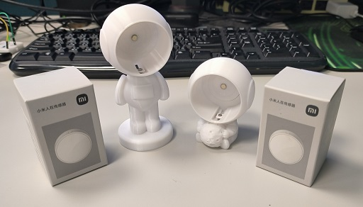
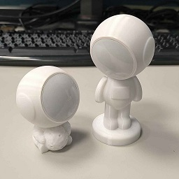
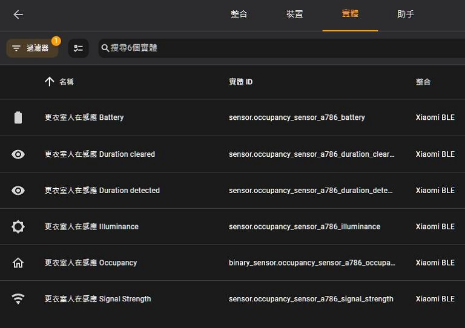

[🧾去選單](../../README.md)

> 發布於: 2024/12/9

# 居家Bluetooth系列：小米電池人在感應器

Yes, 這篇是哈迪首個Bluetooth系列文章!

## 不想看落落長文章的先講結論

- 目前體驗良好的小米電池人在感應器
- 結合紅外線、微波雷達、光照度感應器
- 電池供電，無須走線，設置地點大解放！
- 淘寶售價約人民幣120 (台幣550)
- 採用`CR2450` (注意不是CR2032)
- 標稱續航3年 (有但書下面說明)

### 👍 優點

#### 標稱3年續航力

為提高續航力而採用`CR2450`大顆鈕扣電池。

> 請注意並非是小型的CR2032鈕扣電池喔

官方聲稱一顆電池具有`3年`續航

如若為真，那確實是非常好用的產品

不過續航會因為**靈敏度、觸發時間**而有所不同

#### 安裝位置沒有限制

電池供電所以不需要額外煩惱電力線，想放哪裡就放哪裡。

#### 精美的太空人配件

可以在淘寶購買太空人3D配件如圖，直接化身裝飾品

大大的提高顏值，擺在家中任何角落都不突兀了

#### 人在觸發迅速反應

日前與白牌的電池人在感應架設在相同的位置做比較

體驗上小米的**觸發速度更快**

家裡已經淘汰了兩個白牌電池人在感應

全部替換成小米電池人在感應了

### 👎 缺點

#### 沒有干擾排除功能 (待確認)

> 更新: 近期韌體更新，米家APP似乎出現此感應器的干擾排除功能

此產品無法設定干擾排除，因此要慎選安裝位置，避免干擾源錯誤的觸發事件

#### 更換電池困難

背板設計不良，要打開更換電池很吃技巧

我本人第一次要打開背蓋時就把背板刮花

不過知道技巧後就不是問題了

打開技巧下方會再說明

> 有網友反應此產品設計，剛好可直接用CR2450電池開背板

#### 安裝在錯誤的地點會加速電量消耗

請勿安裝在臥室、客廳等長時間有人的區域

否則雷達持續運作會快速消耗電池電量

#### 接入HA方式較為複雜

此產品可以透過HA的`Xiaomi BLE`整合直接添加

但你必須先將HA核心升級至`2024.10`以上的版本

並且還要知道**如何取得小米產品Token**

#### 初次接入HA會讓人困惑

部分BLE訊息廣播周期很長

例如電量可能要等8個小時才更新一次

人在感應狀態、光照值不會持續廣播出來

須主動觸發狀態改變才會在HA中看到相關內容

#### BLE運作模式的限制

低功耗藍芽(BLE)裝置是採用廣播的方式傳遞訊息

一旦你的HA主機錯過了一次廣播訊息

你將不會再次收到該觸發事件

請**確保HA主機端的藍芽接收能力**穩定性

#### 光照度的可用性

光照度會定時發出BLE廣播

可以做為環境亮度參考

但是礙於電池節約需求導致廣播週期較長

拿來做開關燈判斷會有很大延遲

比較適合當作日出日落的大環境判斷

但這類產品適合安裝在室內且遠離窗戶等干擾源

導致光照度功能使用上有點矛盾

#### 部分功能需依賴米家APP

一開始要先與米家APP配對並取得Token

另外如果你想要調整感應器參數、升級韌體

也需要使用米家APP才能操作

不過除了以上需求外是不用依賴米家APP的

你也可以在HA設定完成後直接刪除米家APP

## 🏪 商店

哈迪手上兩顆都用的好好的

目前沒有打算釋出

---

## 正文開始

本篇是我首個藍芽裝置的心得分享

因為哈迪沒有小米藍芽網關

這邊主要是**以沒有小米網關的方案**去做說明

如果是已經有在使用`Xiaomi Gateway 3`的夥伴請自行摸索

另外這邊不會再花太多篇幅去介紹取得小米Token

還請各位**自行搜尋取得Token**的方式

關於Token這邊僅提醒一點

那就是使用米家APP配對請先切換至`中國伺服器`

台灣地區似乎還沒有支援這個小米電池人在感應器

請先準備以下其中一種藍芽接收方案

- 小米藍芽網關配合Xiaomi Gateway 3整合使用
- HA主機有藍芽模組/試配器功能
- 用ESP32晶片搭配ESPhome作為藍芽代理

另外請注意以下問題

- 準備全新的CR2450電池一顆
- 將HA核心升級至2024.10以上的版本
- 盡量不要跟第三方Passive BLE Monitor工具一起使用
- 確認藍芽接收端的周圍沒有明顯的2.4GHz干擾源
- 裝置加入HA後請耐心等待一天

以下是將小米電池人在感應配對至HA的流程

1. 將`HA核心`升級至`2024.10`以上

此感應器僅在`2024.10`之後支援

升級核心版本可能會遇到很多問題

若要更新核心請做好備份

2. 將感應器更換一顆`全新的CR2450`電池

此產品附贈的電池**沒有**給你用隔離墊片

出廠後放在倉庫的時間一直都在消耗電池

使用原廠電池很大機率你會遇到奇奇怪怪的問題

不要不信邪，哈迪已經幫各位踩過坑了

一個感應器500多塊都花了

再給它買一顆**全新**的CR2450電池吧!

3. 用米家APP中國區配對感應器

請注意一定要先將你的帳號切換至`中國伺服器`

**長按感應器的側邊按鈕**來進入配對模式

此時感應器會有藍燈閃爍

配對成功後APP會提示你沒有藍芽網關 (如果你沒有)

這部分**不影響實際使用**

你還是可以在米家APP中設定感應器參數

進入感應器頁面>滑動到頁底>感應設定

可以設定感應靈敏度以及無人判定的延遲時間

4. 提取感應器的Token

提取方式這邊不做說明

請各位自行在github搜尋`Xiaomi-cloud-tokens-extractor`

並且依照指示提取Token

> 請注意若在米家APP重新綁定感應器，Token是會改變的，此時得重新取得Token，注意不要踩到這個坑

5. HA會自動發現裝置

如果HA核心已經更新至`2024.10`以上

並且也有合適的BT接收方案

那麼此小米感應器會**自動出現**在裝置列表中

我們只需要設定它並且輸入Token就可以了

感應器將透過Xiaomi BLE整合加入你的HA系統

6. 耐心等待或主動觸發所有數值

加入HA之後你發現感應器缺少很多數值

這時候可以耐心的等待一天再來檢查

或是你也可以手動觸發有人/無人判斷

例如將感應器朝向無人的牆壁或是你跑去躲起來

一但感應器觸發改變就會廣播有人/無人判斷

此時HA中的實體就會更新出現了

請注意`電池數值`需要**數小時**的時間才會出現

`光照度數值`也需要一定時間才會更新

完整的數值列表可參考附圖

7. 大功告成

恭喜你加入了超棒的小米電池人在感應

趕快去設定自動化玩玩看吧!

---

## 使用心得分享

本產品已經在家裡穩定使用2個月以上

目前體驗比之前那個糟糕的白牌感應器好多了

來這裡複習之前的不推文避雷一下

[居家Zigbee系列：(不推) 電池版人在感應](../../blog/zigbee/tuya_battery_human_presence_sensor.md)

小米的感應器反應非常快速，續航力目前兩顆還OK

使用兩個月都還維持100%的電量

但同時也讓我懷疑電量數值的準確性

只能讓時間證明一切了

哈迪同時也在淘寶買了這款感應器專用的

兩款太空人3D列印模組 (如圖)

頭部零件是可以**上下左右調整角度**的

顏值非常高，擺在玄關賞心悅目

安裝方式非常簡單

看本文影片就知道怎麼裝了

https://github.com/user-attachments/assets/43401733-0a07-4975-8bc0-b97dbc3e0a2e

太空人支架價格不算便宜 (一個100~200台幣)

如果不是顏值控的夥伴就不要浪費這個錢了

官方的磁吸底座能隨意旋轉360度

磁力非常強，遇到地震應該是不會掉下來的

還能黏在牆上或天花板已經非常好用

磁吸的方式可以參考本文影片

https://github.com/user-attachments/assets/c0c6e297-80cb-4ac2-b7ed-09437274f012

https://github.com/user-attachments/assets/62a9c0ce-549b-4aa5-9bb1-e3c47039b34f

---

## 缺點

個人感覺背板設計不良

要打開更換電池很困難

> 有網友反應此產品設計，剛好可直接用CR2450電池開背板

可以用一個50元硬幣或堆疊兩個10元硬幣

塞入背後的一字型缺口

一定要找到合適的硬幣剛好塞滿洞口

否則你會很難施力打開

確保硬幣卡緊後請逆時鐘大力轉動它

此產品卡榫巧奪天工

不要懷疑，**大力出奇蹟**

重點是背蓋還有強磁吸附力

取下背板要花不少力氣

我本人第一次要打開背蓋時就把背板刮傷了

但理解技巧後就不是問題

還有一個缺點就是光照度的數值

實際使用上有點矛盾

因為本產品的光照更新數值不太頻繁

比較適合應用在白天及夜晚的自然光判斷

但是這類感應器比較適合安裝在室內

並且理應遠離門窗等氣流干擾

這樣的情況下又無法拿來判斷自然光

用來當作室內燈是否開啟又不夠即時

總之有點雞肋

---

## 產品擺放技巧

各位必須知道產品背後的技術面

微波雷達是一種**非常耗電**的人體檢測方式

這就是市面上雷達感應器大多是走**有線供電**的原因

而小米這類吃電池的複合式人體感應器

就利用紅外線(PIR)去做初始觸發

判斷有人之後才由雷達接手持續偵測

所以可以做到長時間待機也不至於特別耗電

有鑑於此

請各位在布置這個感應器時要慎選地點

**不要**安裝在臥室或客廳這類**長時間有人**的地點

> 以上地點請使用有線供電的方案

最佳安裝地點是在`更衣室`及`玄關`

在室內少有干擾源的同時又不會長時間有人在

另外`廁所`及`陽台`也**不適合**安裝

因為會受到諸多干擾源的影響

紅外線跟雷達感應都有誤報的可能性

紅外線會被近似人體溫度的熱源干擾

夏天時這種情況會更加明顯

以後台灣夏天室外的PIR應該都無法正常運作了

雷達則是會被空調風扇、洗衣機震動、水流等因素干擾

此產品目前無法設定干擾排除

> 韌體更新後似乎出現干擾排除功能，待驗證

因此要慎選安裝位置

避免干擾誤觸發

這邊值得一提的是

小米很積極的在更新此感應器的功能

例如最近發現米家的設定頁面中多出了更多功能

似乎可以設定排除干擾源

不過哈迪手上沒有多餘的感應器可以玩玩看新設定

已經安裝好的設備盡量是不要去動它了

各位可以摸索看看最新的功能

---

## 低功耗藍芽(BLE)的限制

BLE裝置是採用**廣播**的方式傳遞訊息

不會去管主機是否正確收到消息

這也是BLE裝置達到低功耗的條件之一

但同時也是個需要考量的限制

一旦你的主機錯過了一次廣播訊息

那麼BLE裝置也不會再主動重新發送了

你將直接錯過這次的觸發事件

如果是溫濕度計丟包還算小事

但人體感應觸發丟包就很拉低體驗了

這取決於HA主機端的藍芽接收能力

你的接收端藍芽模組必須足夠穩定

同時也應避免一個模組同時啟動WiFi及BT功能

如果是採用ESP32的藍芽代理功能

就一定會踩到WiFi與BT輪流占用2.4GHz天線的問題

搞丟BLE廣播的機率就更大一些

除非你是使用Ehternet方案的ESP32

這個哈迪暫時沒有研究

目前是使用USB藍芽模組讓HA有藍芽功能

幾個月下來的感應自動化開燈體驗是良好的

之後會考慮購買更多

---

## 總結

以台幣500多的價格來說是非常厲害的產品

已經穩定使用2個月沒有體驗不佳的狀況發生

但是安裝地點要慎選，不要布置在經常有人的空間

盡量的避免微波雷達的長時間運作，否則會快速消耗電池

---

## 免責聲明

本貼文沒有任何業配或推坑，純粹是個人經驗分享，高CP值的產品可能因為生產公差、用料、審美、個人運氣等因素導致每個人商品體驗不同，請謹慎評估後購買。

[🧾去選單](../../README.md)
