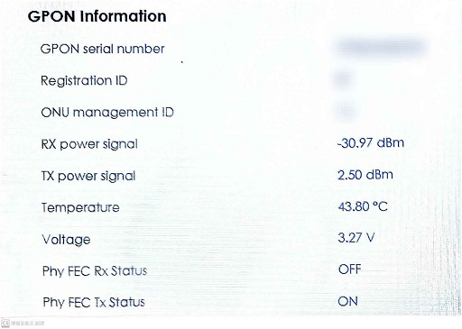

[🧾去選單](../../README.md)

# 哈迪碎念 - 閒聊系列：外網斷線時對於HA的影響

兩天前家裡發生了智慧家庭的噩夢：`中華電信外網斷線！`

你說都已經在用HA了還怕什麼外網斷線？

且慢，這邊指的是HA以外的其他系統啦。

如果你用的是塗鴉雲、米家這種需要連**對外伺服器**的智慧家庭系統，家裡外網斷線時就芭比Q了。
手機沒辦法控制，自動化也可能出現問題，還有家裡透過無線方式綁定的雙切開關、隨意貼開關，都可能受到影響。

> 部分系統有本地網關的情況下，外網斷線時大部分功能還是可以正常運作，不過不在此討論範圍。

這時家裡其他人就會跟你哀哀叫：「為什麼家裡有些開關可以用有些不能用，早就跟你說不要搞什麼智慧家庭，用普通的開關就好了，是多懶惰，我現在都不知道哪個能開哪個不行，你這樣blablabla... (以下略)」

然而如果你在家裡的區域網路安裝了`Home Assistant`這個超棒的開源智慧家庭系統，就可以遠離這些煩惱了！

## 正文開始

家裡中華電信網路周三突然斷線，起初是我回到家發現連上家裡WiFi後卻沒辦法上網，後來老婆說今早出門上班前就發現這件事了，而且前一天晚上睡前就感覺網路卡卡的。

想說早上我怎麼都沒發現，因為我通常早起就直接出門，沒有滑手機的時間，而且家裡的智能開關跟玄關自動開燈都正常運作。

哎呀，原來是因為我在家裡裝了超棒的`Home Assistant`系統，外網斷線也能正常運作，當然沒有這些問題囉！

> Home Assistant基金會可以來找我業配嗎？

登入小烏龜數據機看到下載訊號強度 (Rx Power Signal) 掉到`-30dBm`以下，不過上傳訊號 (Tx Power Signal) 看起來很正常，可參考附圖；對外則是直接顯示離線狀態。

是說各位家裡的下載訊號強度都是多少呢？通常可以在小烏龜工程模式中的PON Status類似頁面找到。

但這幾天網路一直還沒有報修，畢竟現代人手機網路吃到飽滿到溢出，家裡WiFi不能用其實影響不大，Google TV也能連手機熱點看電視，不辦光世代好像也OK阿？

> 開玩笑的，有線網路有其必要性

不過在沒有中華電信網路的這幾天，我還是有遇到一些問題：

### 手機連不上區域網路的HA介面

家裡的WiFi是用中華電信全屋通小黑盤，發現小黑盤在外網不通的情況下竟然會有問題，手機連上全屋通卻無法ping到區域網路內的其他IP，多麼奇葩的鳥事啊，最後我用ethernet進去小烏龜的後台把WiFi AP打開，連上小烏龜的WiFi就可以正常使用HA網頁介面了。

我也不想用全屋通，但現階段是寄居在老婆家跟岳父岳母同住，還在等待新屋落成，所以別人家的網路我沒有權利更動。

### Zigbee2mqtt配對後產品圖片無法顯示

我在斷網期間也有配對新的Zigbee設備到Z2M中，看來Z2M的產品圖是直接上網去抓的，所以日誌會一直出現相關錯誤訊息，圖片沒辦法抓下來。

### Home Assistant Core無法更新

**廢話！沒有網路怎麼更新！**

我只是最近買了`小米電池人在感應器`回來玩，想透過ESP BT Proxy接入`小米BLE`集成中，看到之前有夥伴發文討論`HA Core`要先升級到`2024.10`以上，我現在遲遲還沒有辦法完成這個項目。

等之後成功了再來發文分享設定及使用心得，各位可以期待一下。

附圖先偷偷附上花**超多錢**買的超可愛的小米人在太空人模型！

### 部分需要外網的服務無法使用

如果你的自動化有**依賴到網路服務**，例如`天氣自動化`、`Google Home串接`、`網路TTS`... 之類的功能，都會受到影響。

請小心的檢查你的自動化腳本是否有足夠的容錯能力，例如你在撰寫自動化時第一步就需要外網確認某些流程，但是當那些數值不可用時你沒有設定正確的錯誤處理流程，最後你的自動化腳本就陷入了一些奇怪的狀態，甚至你家的某處智慧燈開始變成**激烈的Disco舞廳**。

---

最後再讚嘆一下優秀的台灣社團，Taiwan Home Assistant社團總是能翻到很多有用的文章，前輩們的經驗分享讓我少走很多彎路。

有些人可能覺得我講話很囉唆，每次文章都落落長，但我還是會持續分享這些我在HA系統中遇到的大小事，以及使用智能裝置的一些心得，請大家包容啦！

---

## 免責聲明

本貼文就是在推坑HA，但還是要說HA系統對新手來說有陡峭的學習曲線，並且部分進階功能需要了解一定程度的程式碼，推薦有熱忱的夥伴入坑嘗試。
#HomeAssistant

[🧾去選單](../../README.md)