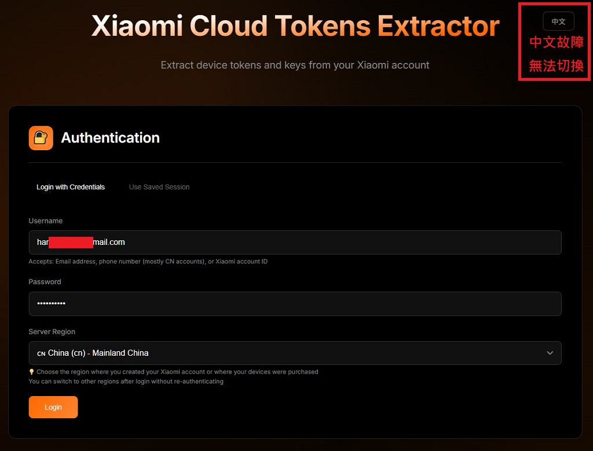
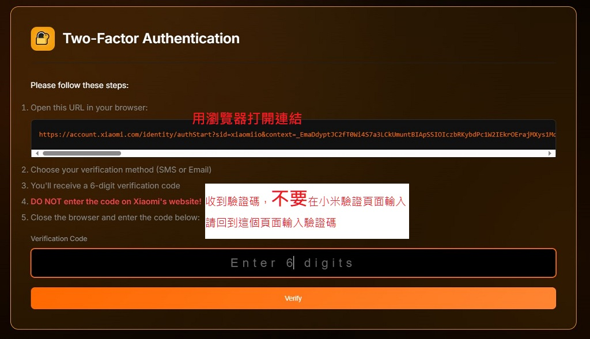
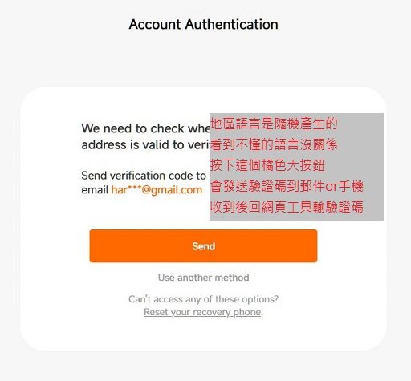
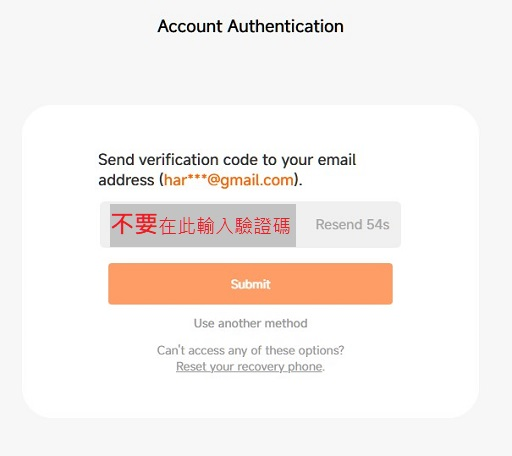
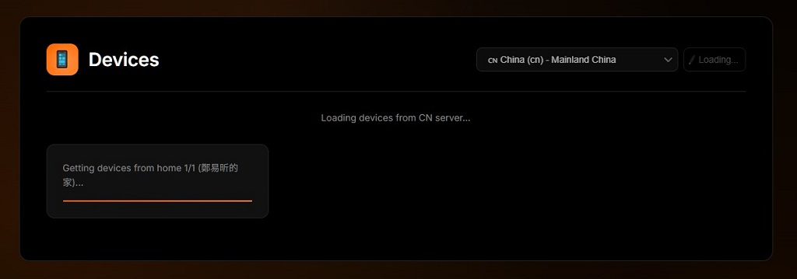
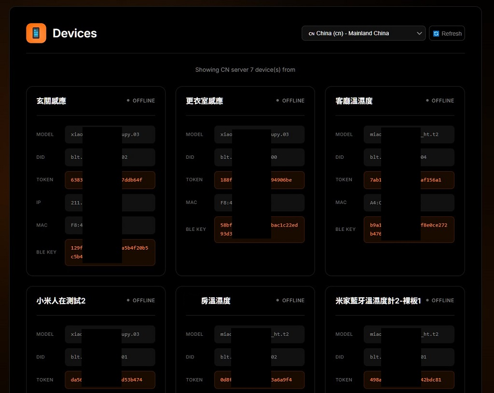
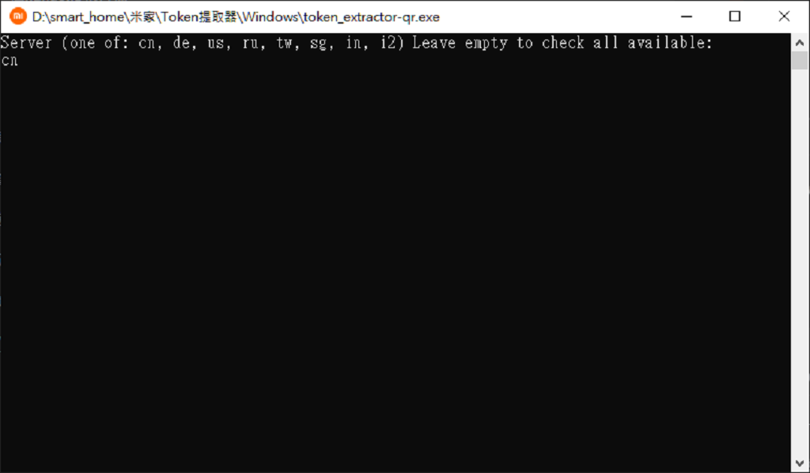
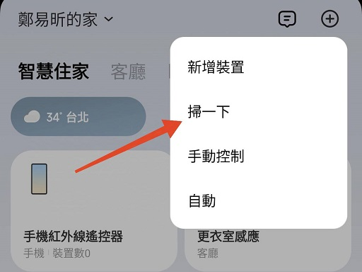
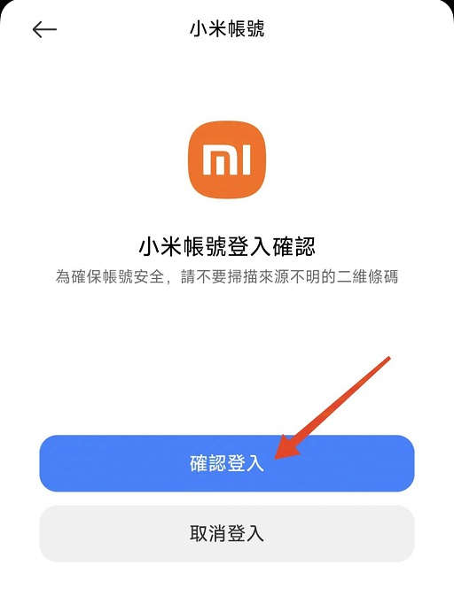
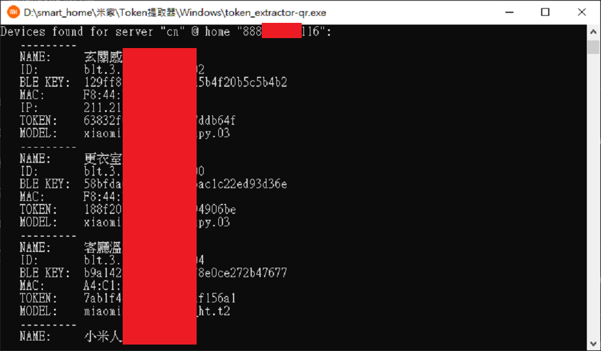

[🧾去選單](../../README.md)

> 發布於 2025/07/22

# 閒聊系列：小米Token提取失敗的解決方案

近期米家登入驗證的流程更動

導致`Xiaomi-cloud-tokens-extractor`工具失效

連同基於以上工具的Home Assistant內建`Xiaomi BLE帳號密碼登入`方法也失效

目前已確認幾種可行解決方案如下

> 危險警告！小米Token提取工具表示主動將帳號密碼交給第三方人士，使用此類工具時請自行斟酌相關風險

- [網頁版二階段驗證工具](#網頁版二階段驗證工具)
- [QR Code登入工具](#qr-code登入工具)

## 網頁版二階段驗證工具

來自於rankjie某中國開發者的專案（[Github專案](https://github.com/rankjie/xiaomi-tokens-web)）

原作者有在`Cloudflare`架設網頁工具如下，可直接使用

https://xiaomi-token-web.asd.workers.dev/

如果對於第三方服務本身有資安疑慮的高級玩家

可以透過`npm`、`node.js`建置**本地端網頁服務**

或是使用個人Cloudflare帳號去架設服務

以上進階用法需要一定經驗與基礎

哈迪這邊不多做說明

以下使用原作者提供的網頁工具作為範例

### 網頁工具使用步驟

輸入你的小米帳號密碼

並依照需求選擇伺服器

> 此工具的中文化頁面無法正常切換，待作者修復

登入後如果判斷你需要二階段驗證

會跳出二階段驗證的驗證碼頁面

按照步驟打開驗證連結，並發送驗證碼請求

> 注意！**不要**在小米驗證請求頁面直接輸入驗證碼，收到驗證碼後請回到網頁工具輸入驗證碼

小米驗證請求頁面可能會隨機出現不同地區語言

直接按下方的橘色大按鈕送出驗證碼申請

此頁面會顯示驗證碼即將送至哪個郵件或手機

等待一段時間後，會收到一則六位數驗證碼通知

> 建議盡量使用**電子郵件**登入，海外簡訊可能會被電話業者阻擋

> 如果郵件找不到驗證通知，試著去垃圾郵件尋找

再次提醒

收到驗證碼後`不要`直接在小米驗證頁面輸入

收到驗證碼後`不要`直接在小米驗證頁面輸入

收到驗證碼後`不要`直接在小米驗證頁面輸入

回到網頁工具輸入驗證碼並點選`Verify`按鈕

> 這個步驟會卡好幾秒，請耐心等候，不要重複點擊按鈕

仔細觀察右上角，如果沒出現任何錯誤訊息

就會開始自動抓取米家設備的資訊清單了

大功告成！

抓取成功後的頁面如下

## QR Code登入工具

來源於中國HA討論區的Windows程式工具（[來源網頁](https://bbs.hassbian.com/thread-29644-1-1.html)）

此工具需要搭配**米家APP掃碼登入**功能

執行檔我已經從百度網盤移植到[本文此處](attachments/token_extractor-qr.zip)

## 掃碼登入工具使用說明

解壓縮後會看到一個Windows執行檔`token_extractor-qr.exe`

> 未知的執行檔可能會被防毒軟體阻擋

執行後請求輸入伺服器名稱，例如：`cn`或`tw`

輸入後會自動下載QR Code圖片並開啟

如果沒有自動開啟，請在執行檔目錄尋找`temp_qr.png`

接著打開米家APP右上角`掃一下`功能

掃描QR Code之後按下`確認登入`

大功告成！

等待執行檔自動抓取設備清單

## 免責聲明

以上工具來自於第三方開發者

如果對於無法審查源碼感到不安全

請自行斟酌是否使用此類型代理工具

並且自負帳號密碼洩漏所導致的風險

#HomeAssistant #Xiaomi #BLE

[🧾去選單](../../README.md)