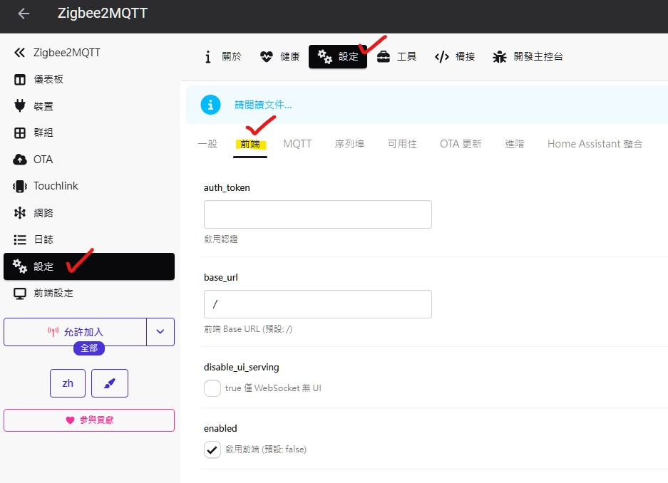
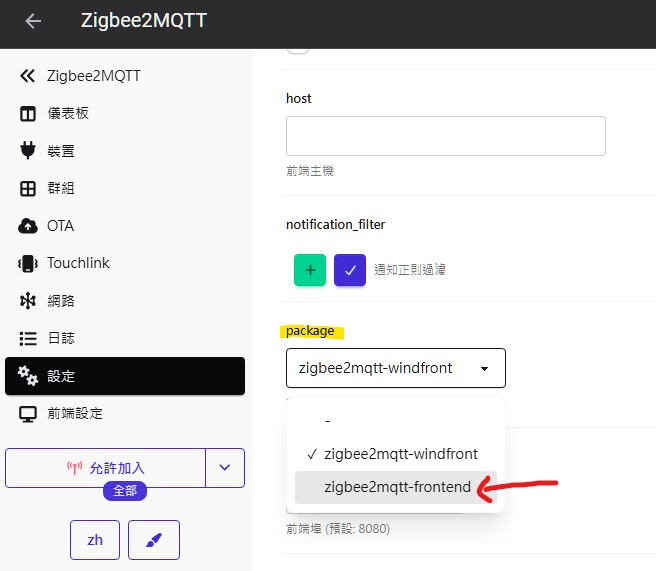
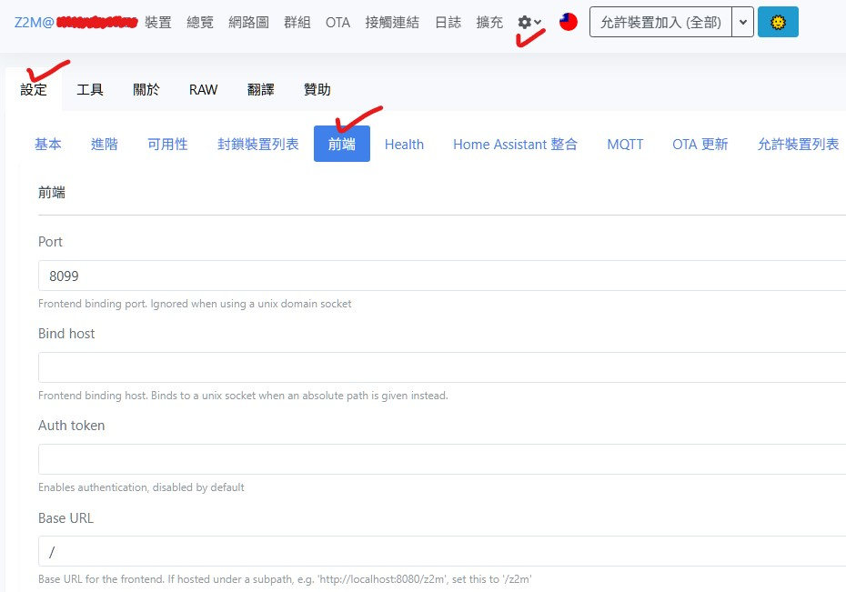
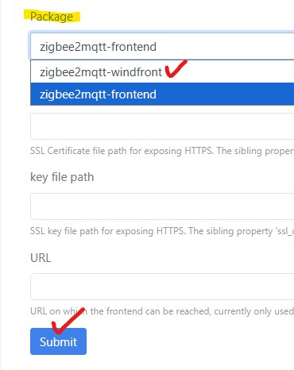

[🧾去選單](../../README.md)

> 發布於 2025/11/28

# 教學系列：如何換回Zigbee2mqtt舊主題

Zigbee2mqtt `2.6.2` 起預設套用 `Windfront` 新版主題，配色與排版都和舊版差異很大。

如果你比較習慣早期的簡潔風格，可以透過下列方式快速切換回來；同樣的設定流程也能讓你改回新版主題，視需求自由切換。

## 換回舊版主題

1. `進入Zigbee2mqtt介面` → `設定` → `前端 (Frontend)`，在 `package` 區塊找到 `zigbee2mqtt-frontend`並勾選。
   
   
2. 重新啟動 Zigbee2MQTT，前端就會以設定好的主題載入。

## 切換到 Windfront 新版主題

1. 路徑與前述相同：`進入Zigbee2mqtt介面` → `設定` → `前端` → `Package` → `zigbee2mqtt-windfront`。
   
2. 設定完成後務必按下畫面下方的 `Submit` 按鈕，讓變更寫入設定檔，再重新啟動 Zigbee2MQTT。  
   

## 個人小廣告

有在幫忙做淘寶代購智能產品

會配合淘寶的各大購物節調整預售價格

> 618、雙11、以及其他不定時出現的購物節

優惠價請參考預購商城，現貨通常不會調降

商城電子名片（預購/現貨/雜貨）

https://linktr.ee/hardy3c

#Zigbee2mqtt #HomeAssistant

[🧾去選單](../../README.md)

