[🧾去選單](../../README.md)

> 發布於: 2025/12/31

# 居家WiFi系列：Reolink E1 Pro 5MP 可移動AI攝影機

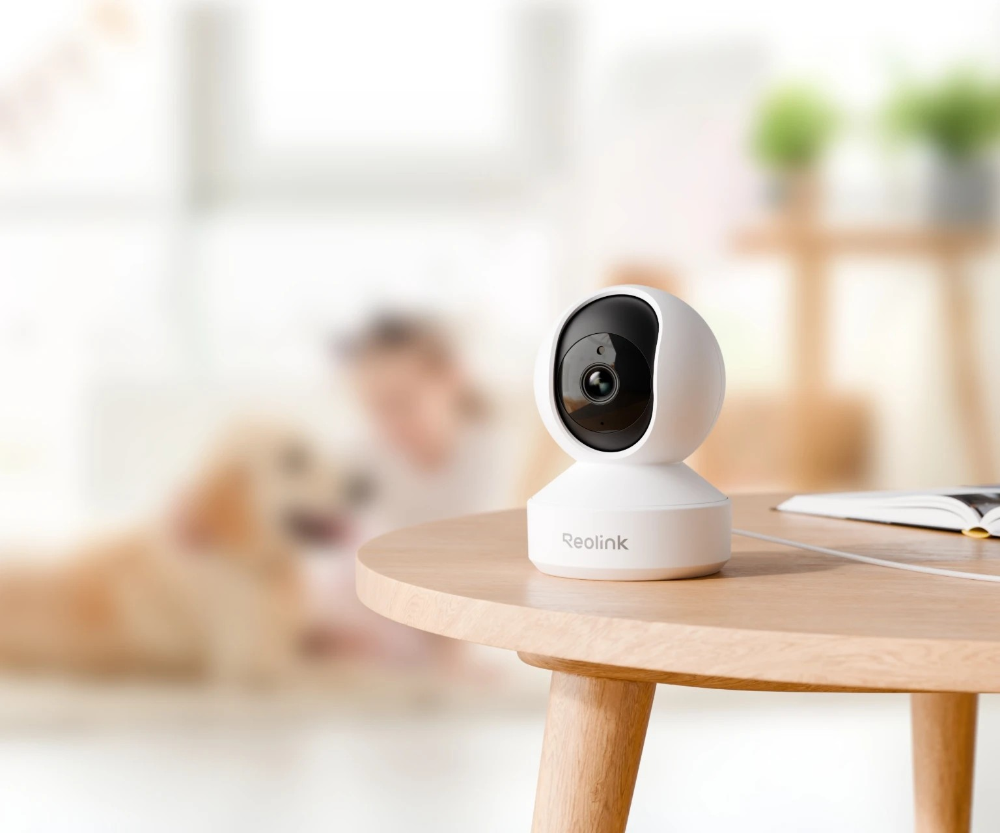

## 快速總結

Reolink E1 Pro 可移動AI攝影機

- 提供 5MP 解析度，主串流可達 20fps。
- 支援 355° 水平與 50° 垂直旋轉，實現（幾乎）無死角監控。
- 支援物件自動追蹤功能（僅水平方向）
- 可設定多個預設位置，具備斷電記憶功能。
- 內建 AI 演算法識別人形、動作、寵物和哭聲。
- 內建麥克風與揚聲器，支援即時雙向語音通話。
- 配備紅外線 LED 燈，夜視環境自動切換IR。
- 支援最高 512GB MicroSD 記憶卡（無附贈記憶卡）
- 支援隱私模式功能，可透過軟體控制關閉攝影機。

**接入 Home Assistant：**

可透過 Reolink 官方整合接入 Home Assistant

支援影像串流、AI偵測事件、PTZ控制等功能

接入前需在 Reolink App 先做設定配對（WiFi連接、攝影機登入帳密設定）

支援 `2.4GHz/5GHz雙頻Wi-Fi` 或 `RJ45有線網路`

> 無線/有線網路共存時，有線網路優先

建議使用 5GHz Wi-Fi 或 Ethernet 以獲得穩定的串流品質

## 👍 優點

### 網路介面支援

支援 Wi-Fi 2.4GHz 或 5GHz 頻段無線連接

同時具備 RJ45 乙太網路連接埠

可選擇有線連接以獲得更穩定的網路品質

### Home Assistant 支援性

HA當中的 `Reolink` 整合是最高等級白金級整合

品牌也是少數被認證的 Home Assistant 官方合作夥伴之一

非常容易整合進入HA系統

### 完全本地化

據目前網路上的資訊回報

Reolink攝影機可以在沒有外部網路的情況下運作

> 自行設定防火牆阻擋攝影機的對外連線

讓室內攝影機只在區域網路運行

最大程度的保持可控的安全性

## 👎 缺點

### 購買渠道困難

台灣或淘寶沒有渠道可購買

不同國家的代購平台基本上價差也都很大

還要考慮附贈的電源規格是否符合台灣

建議購買`日本`或`美國`的版本

### 價位偏高

外國平台購買普遍換算台幣約 `NT$1,600~NT$1,800`

加上國際運費與稅金平均成本可能要抓 `NT$2,000`

> AI實時偵測附加價值很高，不過需求見仁見智

### 不支援 PoE

雖然具備乙太網路埠，但無法透過乙太網路供電（PoE），需使用 DC 5V電源供電。

### Home Assistant PTZ 控制

目前不太滿意的部分就是 HA PTZ 控制

透過 Reolink 整合的 PTZ 上下左右觸發後會一直跑

直到移動到邊界或主動按下`PTZ停止`按鈕才會停止

這點在使用上稍微不便

### 容易混淆的舊版本硬體

目前已知 Reolink E1 Pro 早期的版本（4MP或以下）

是無法直接支援加入 Home Assistant Reolink 官方整合

但是現在早已經沒有市售舊版型號的 E1 Pro

如果是在二手交易市場的話才要注意硬體版本問題

請認明 `5MP或以上`的解析度規格才能支援 Home Assistant Reolink

## 🏪 商店

[現貨商品](https://myship.7-11.com.tw/general/detail/GM2406268597737)

有一個已拆封新品，以**原價八折**計，售完為止

[預購商品](https://myship.7-11.com.tw/general/detail/GM2411287898818)

基本上會透過美國或日本亞馬遜訂購

每次最多代購兩個，預購名額有限售完不補

> 自行採購的話推薦購買`日本`或`美國`版本

## 正文開始

今天介紹 Reolink E1 Pro 可移動AI攝影機

最近新家裝上了這款攝影機，整體體驗非常滿意

因為 Reolink 是 Home Assistant 的官方合作夥伴

他家的產品可以透過白金級整合接到HA，實測是真的非常簡單

> 本人軟體工程師說的，自行判斷...

不相信的話可以參考[安裝與設定](#安裝與設定)

### 選型說明

Reolink旗下有眾多攝影機型號

以下是HA官方已確認支援的型號

https://www.home-assistant.io/integrations/reolink/#tested-models

基本上更便宜的機型，韌體沒有帶 HTTP API 故無法支援HA整合

別看了，E1 Pro就是最便宜的那款，已經幫各位做好功課了

> 如果有其他選型建議，歡迎在我的[官方LINE](https://linktr.ee/hardy3c)告訴我

### AI功能介紹

內建 AI 演算法

能夠識別人形、動作、寵物和哭聲

並支援水平方向自動追蹤功能

基本上移動中的物體準確度驚人的高

> 但長時間靜止不動的人是不會持續偵測到的

另外我沒有測試嬰兒哭聲跟動物偵測，留給各位自行驗證

### 產品開箱

- 開箱內容物

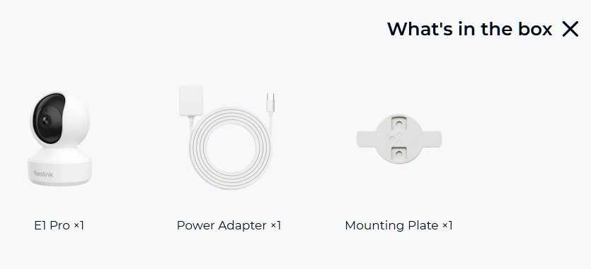

- 產品正面外觀

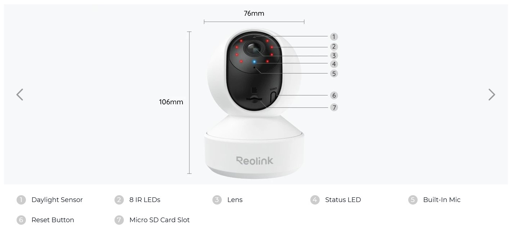

- 產品背面外觀

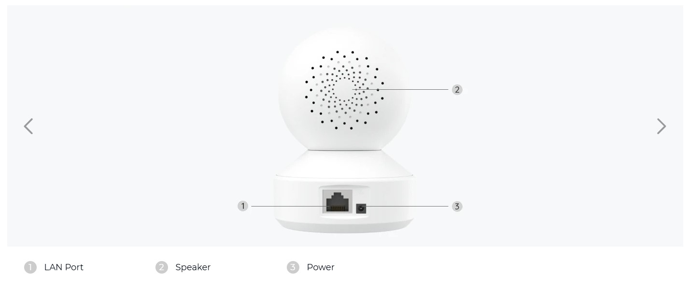

- 實拍圖

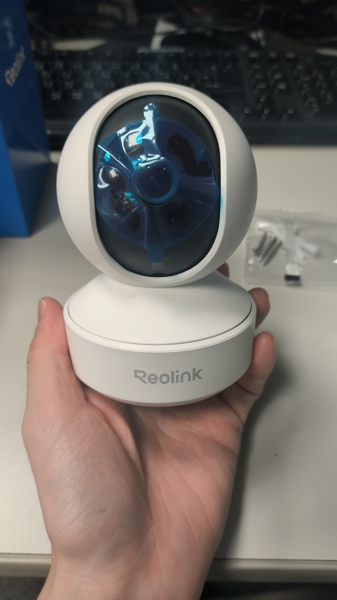

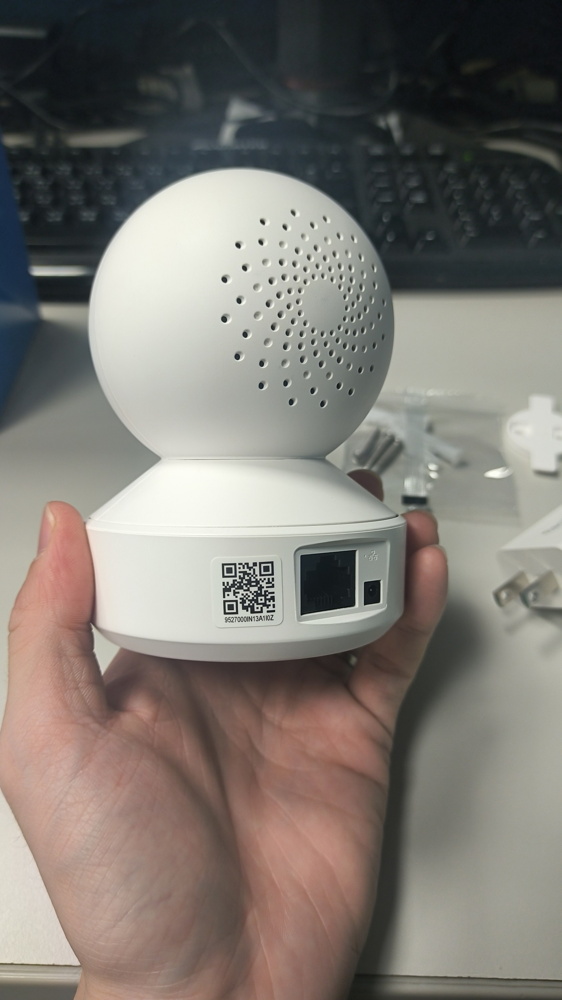

- SD卡安裝位置

> 需要控制鏡頭往上移動，才會露出卡槽

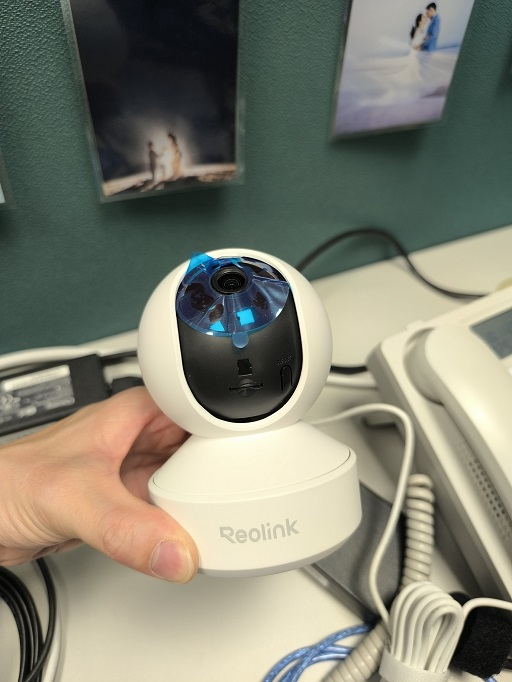

### 安裝與設定

E1 Pro 採用 QR Code 快速配對設定

透過 Reolink App 掃描攝影機背面的配對碼

就能輕鬆完成安裝與設定

請依照以下教學影片操作

接著需要進入裝置確認一下串流協議是否有開通

### 接入 Home Assistant

先確定攝影機是否已經加入 Reolink APP

接著使用 Reolink 白金級官方整合

具備完整功能支援，也能連動AI偵測事件

- 進入 Home Assistant 設定 → 裝置與服務
- 點擊「新增整合」
- 搜尋「Reolink」
- 選擇 Reolink 整合並安裝

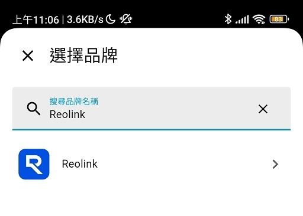

此時就需要輸入攝影機帳號密碼

> 帳號固定是admin；密碼是自定義的，如果忘記密碼請參考[常見問題](#忘記攝影機密碼)

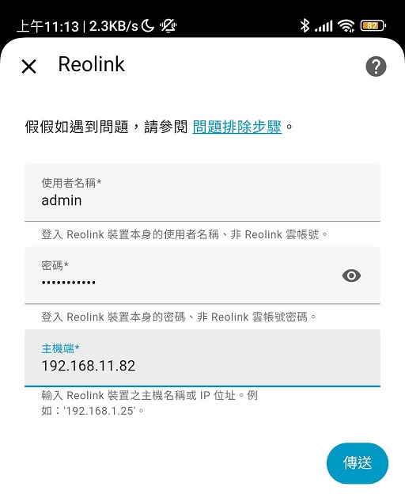

主機端的IP如果不知道怎麼在路由器確認

可以從 Reolink APP 查找設備IP

Reolink APP → 進入指定攝影機設置 → 網絡信息 → IP地址

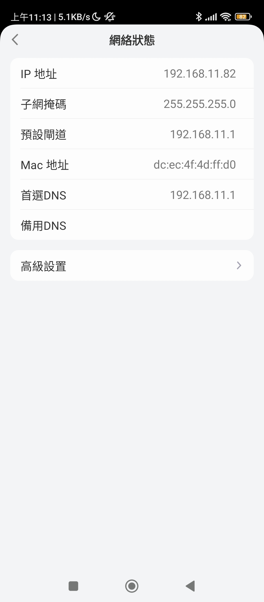

整合完成後，應該能在 Reolink 整合中找到攝影機實體

包括影像串流、移動偵測、物件偵測、PTZ 控制等功能

### 加碼：將攝影機橋接至蘋果 HomeKit

有多種方法可以讓 Reolink 攝影機加入 Homekit

1. 透過 Home Assistant 內建的 Homekit Bridge 功能

最新的 HAOS 內建會為每個 Camera 實體都主動建立配對碼

將攝影機接入HA後重新啟動HA，就會在通知看到配對碼如下

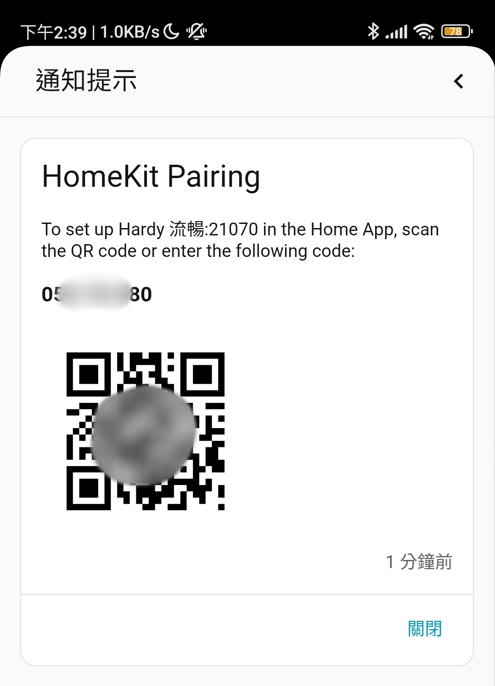

2. 透過 Scrypted 橋接支援 HSV（蘋果安全錄影）

進階使用者可以安裝免費的 Scrypted 外掛

來將你的 Reolink 攝影機轉給 Homekit

它甚至能支援蘋果系統的「安全錄影」功能

給有訂閱 iCloud 方案的用戶的可選功能

這屬於高階玩法，如果你有興趣，歡迎自行研究

https://github.com/koush/scrypted/wiki/Installation:-Home-Assistant-OS

> 有兩個容易混淆的詞彙，Scrypted、Scrypted NVR，前者是免費的，後者要付費訂閱，請自行釐清

### 注意事項

#### 硬體版本相容性

目前已知 Reolink E1 Pro 早期的版本（4MP或以下）

是無法直接支援加入 Home Assistant Reolink 官方整合

但是現在早已經沒有市售舊版型號的 E1 Pro

如果是在二手交易市場的話才要注意硬體版本問題

請認明 `5MP或以上`的解析度規格才能支援 Home Assistant Reolink

#### 網路設定建議

建議使用 5GHz Wi-Fi 頻段或 Ethernet 以獲得穩定的串流品質

主串流預設碼率約 3Mbps

確保網路頻寬充足

避免串流延遲或卡頓

若遇到連線問題

可嘗試將攝影機設定從 TCP 更改為 HTTP

### 常見問題

#### **如何使用壁掛安裝**

原廠有附贈天花板壁掛安裝套件

採用旋轉卡扣如下圖

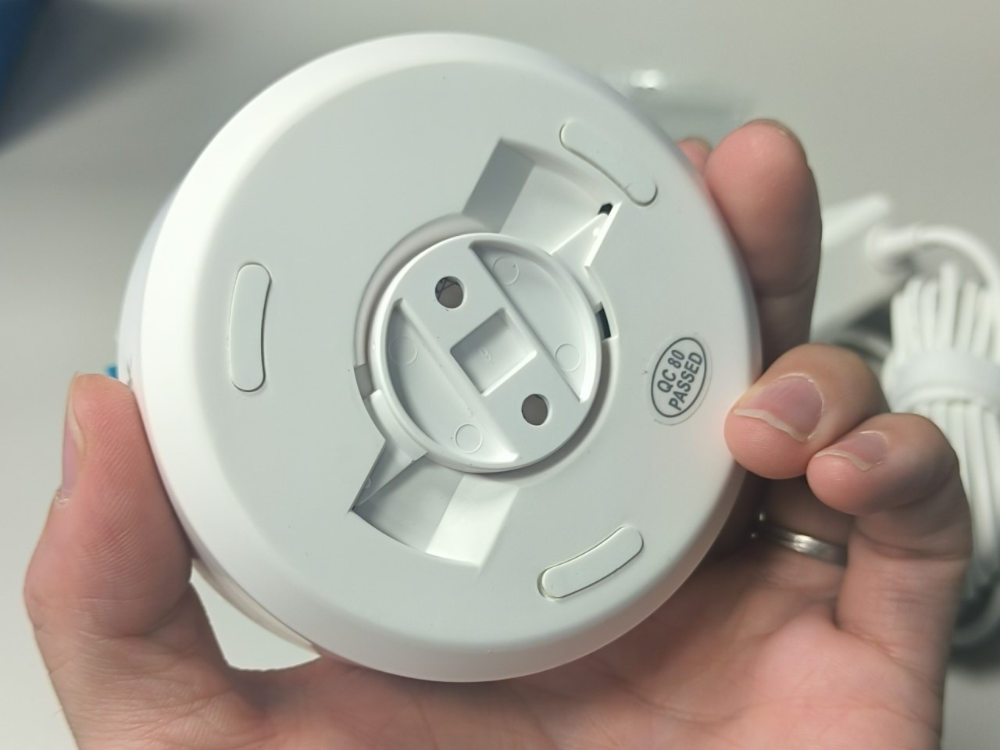

#### **無法在 Home Assistant 中看到攝影機**

- 確認攝影機硬體版本是否支援（需 5MP 或以上）
- 確認 IP 位址、帳號密碼是否正確
- 檢查網路連線是否正常

#### **影像串流延遲或卡頓**

- 檢查網路頻寬是否充足
- 嘗試切換到 5GHz Wi-Fi 頻段或使用 Ethernet
- 降低串流解析度設定

#### **PTZ 控制不會停止**

這是Reolink整合的限制

PTZ控制觸發後不會停止

直到呼叫`PTZ停止`或物理角度抵達盡頭

PTZ控制邏輯需要自行處理

例如寫一個腳本搭配虛擬按扭

每次移動0.1秒後停止

#### **如何把攝影機重設原廠設定**

如果還能軟體控制，將畫面往上移直到裸露SD卡槽。

如果失去控制方法，手動用力將攝影機往上移，露出SD卡槽。

> 手動方案盡量少執行，可能對產品結構有不良影響

通電狀態下長按旁邊的reset按鈕直到提示音響起，此時斷電重啟就能重新配對裝置。

#### **忘記攝影機密碼**

把攝影機重設原廠設定（請參考「[如何把攝影機重設原廠設定](#如何把攝影機重設原廠設定)」）

#### **配對到一半失敗，且無法再次配對**

把攝影機重設原廠設定（請參考「[如何把攝影機重設原廠設定](#如何把攝影機重設原廠設定)」）

#### **已經走 Wi-Fi 無線網路，可以改有線網路嗎？**

可以，並且**推薦**這麼做，有線乙太網路是最穩的方案

隨時插入有線網路並重新啟動攝影機

攝影機會優先使用有線網路介面來連線

> 攝影機內建的有線/無線的網卡不同，所以取得的IP會不一樣

## 個人小廣告

有在幫忙做淘寶代購智能產品

會配合淘寶的各大購物節調整預售價格

> 618、雙11、以及其他不定時出現的購物節

優惠價請參考預購商城，現貨通常不會調降

商城電子名片（預購/現貨/雜貨）

https://linktr.ee/hardy3c

## 免責聲明

本貼文沒有任何業配或推坑，純粹是個人經驗分享，高CP值的產品可能因為生產公差、用料、審美、個人運氣等因素導致每個人商品體驗不同，請謹慎評估後購買。

[🧾去選單](../../README.md)

