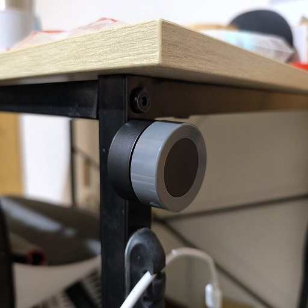

[🧾去選單](../../README.md)

> 發布於: 2025/3/21

# 居家Zigbee系列：兩款無線旋鈕開關

## 快速總結

介紹兩款旋鈕式開關

第一款外旋式黑色

另一款是內旋式白色

兩款都是採用CR2032電池

支援`單擊`、`雙擊`、`長按`、`左旋`、`右旋`

甚至可以取得`旋轉幅度`

基本上要搭配彩色智慧燈泡

白色內旋那款一堆坑，看看底下吐槽

黑色外旋質感更佳，旋轉手感很好

兩者接入Z2M都被認為是黑色外旋的型號

軟體操作模式一模一樣

詳細內容參考Z2M產品頁面

[ERS-10TZBVK-AA](https://www.zigbee2mqtt.io/devices/ERS-10TZBVK-AA.html)

白色價格沒有比較便宜

強烈建議買黑色款

另外注意：

- 盡可能不使用雙擊操作
- 注意旋鈕是在command還是event模式

## 👍 黑色外旋款優點

### 整體做工佳

旋轉段落感不錯

底部磁鐵夠力

可直接吸在冰箱或金屬桌腳

### 原生Z2M支援

我使用的Z2M版本是`1.40.2`

更低的版本就無法保證了

### 價格不錯

淘寶價62人民幣 (約280台幣)

建議找冬瓜智能買

可以拿上方產品圖去搜

## 👎 黑色外旋款缺點

### 被我遇上耗電機王

拿到第一顆用不到2個月就沒電了

換了三顆電池都一樣情況

店家免費換貨後目前正常使用中

暫時算是有加分回來

### 容易誤觸旋轉事件

因為外旋式設計

旋鈕開關點擊時

容易不小心旋轉到

可能在點擊事件之前先觸發旋轉事件

### 產品功能比較複雜

模式分成`command`跟`event`

不同模式會有不同事件

如果要同時支援兩種模式

自動化的設定需要一番工夫

### 模式切換方式無法修改

預設`點擊三下`會切換模式

並且此行為**無法設定修改**

所以如果有使用`雙擊事件`

就很容易**誤觸**到模式切換

### 旋轉事件不絲滑

採用無線Zigbee的產品

因為耗電與網絡架構限制

不會有預期的絲滑調光效果

## 👍 白色內旋款優點

### 原生Z2M支援

同黑色款

### 不容易誤觸旋轉

相對於外旋式設計

內旋款不太會誤觸到旋轉事件

## 👎 白色內旋款缺點

### 磁性太弱

底部磁性不夠力

必須搭配原廠底座才能吸附

直接吸在冰箱上容易一碰就掉

### 旋轉很難操作

轉動時阻力大

又沒有段落感

要雙手並用才好操作

使用上很不直覺

### 產品功能比較複雜

同黑色款

### 模式切換方式無法修改

同黑色款

### 旋轉事件不絲滑

同黑色款

## 🏪 商店

> 更新: 已售出

上架一款黑色旋鈕開關

比較耗電的瑕疵品半價出售

原價280台幣↘特價140台幣

平均2個月要換一次電池

建議用正版國際牌電池

不過CR2032電池很便宜

可以買回去試玩看看

好玩的話再去淘寶買

[現貨商城](https://myship.7-11.com.tw/general/detail/GM2406268597737)

## 正文開始

今天介紹的是兩款旋鈕開關

一個是塗鴉黑色外旋鈕式開關

產品圖如下

實體外觀如下

另一個也是塗鴉，白色內旋鈕式

產品圖如下

實體外觀如下

都採用CR2032電池

標稱電池續航約1年

兩者主要差異在於**旋鈕的轉動方式**

## 外旋鈕式

黑色那款外旋鈕型式

類似轉動**音響音量鈕**那樣的操作

捏住兩側來實現轉動

整體的段落感處理的不錯

旋轉所需的力道也很輕

缺點是容易誤觸到旋轉事件

尤其是想要觸發點擊事件時

不小心轉到一點點

可能會同時觸發旋轉事件

## 內旋鈕式

另一款白色則是採用內旋鈕型式

旋轉的機構外部還包覆一層外殼

代表使用者無法從側邊捏住旋轉

必須從正面像DJ打碟那樣操作

但是這款非常坑人

轉動機構缺乏段落感

並且阻力很大

我很難用一隻手實現旋轉

往往需要雙手並用

好處是你不會隨便觸發到旋轉

反正哈迪我是覺得難用到不行

現在只當作無線按鈕使用了

基本上就用單擊事件而已

## 磁吸力

黑色與白色兩款磁吸力道差異很大

黑色能牢牢吸附在鐵件或冰箱上

完美融入我的工業風書桌

白色只能配合原廠附的底座才吸得住

我把白色款貼在冰箱上

輕輕碰一下就會往下滑

瞬間感覺智商被侮辱了

我放了一段比較影片

各位自己看看吧

不想多說了

智商稅

https://github.com/user-attachments/assets/bf4873ff-c3c3-421f-98ca-68ee3091d80a

## Zigbee2mqtt

這兩款都支援Z2M直接接入

> `v1.40.2`以上確定可以

但是兩者進入配對模式的方式不同

都**不是**長按主要按鈕喔

黑色款是要長戳後面一個reset小洞

白色款是長按側邊一個小按鈕

LED小燈閃爍即進入配對模式

有趣的是白色是山寨款

兩者在Z2M顯示的型號都是黑色款

支援功能跟操作行為都一模一樣

詳細內容可以參考Z2M產品頁面

[ERS-10TZBVK-AA](https://www.zigbee2mqtt.io/devices/ERS-10TZBVK-AA.html)

這邊有個大坑要跟各位報告

這款在Z2M運作有兩種模式

- `command` 指令模式
- `event` 事件模式

不同模式會有不同的操作事件

透過`點擊3下`會自動切換模式

所以哈迪建議**不要**使用`雙擊`

不小心觸發三擊，模式會切換

回傳的事件會變得不一樣

這時你的自動化可能失效了

必須再把模式切回來才行

除非自動化有同時支援兩種模式事件

否則雙擊事件在日常使用上會搞到自己

**若非必要請遠離雙擊操作**

## command 指令模式

> (實際操作)：(事件名稱)
- 左旋：亮度降低
- 右旋：亮度提高
- 單擊：切換
- 長押(3秒)：色彩變更
- 長押放開：色彩變更停止
- 按住左旋：色溫降低
- 按住右旋：色溫提高

這邊又有另一個坑

指令模式支援**按住旋轉**

黑色外旋式按住旋轉還算容易

捏著旋鈕往內推同時轉動就行

但白色內旋式倒是搞笑了阿

長按+旋轉難如登天

還不如去爬喜馬拉雅山更容易

> 實際上雙手併用是做得到的

> 但我為何要這樣折磨自己呢

## event 事件模式

> 實際操作等於事件名稱

- 左旋
- 右旋
- 單擊
- 雙擊
- 長押

## 其他操作

- 三擊：切換模式
- 長押重置鍵：進入配對模式

詳細的操作說明可以參考Z2M產品頁面

[ERS-10TZBVK-AA](https://www.zigbee2mqtt.io/devices/ERS-10TZBVK-AA.html)

## 進階用法

如果你想要取得**旋轉的幅度**

可在指令模式下讀取`action_step_size`

> 注意: event mode沒有辦法辨識旋轉幅度

不同的旋轉幅度會有不同的數值

但沒有明確定義數值與角度的對照

可以自行摸索最適合的自動化設定

## 無線旋鈕常見誤解

提一下無線旋鈕開關經常的誤解

採用無線Zigbee的產品

因為**耗電**與**網絡架構**限制

**無法密集**的傳輸旋轉事件

所以搭配智慧燈泡調光時

要等你旋轉並**放開**的時候

才會發出一次旋轉事件

**因此不會有預期的絲滑調光效果**

## 總結

黑色外旋式可玩性高

白色內旋式非常不推

旋鈕開關樂趣大於實用

有點像是翻轉魔方那樣

## 免責聲明

本貼文沒有任何業配或推坑，純粹是個人經驗分享，高CP值的產品可能因為生產公差、用料、審美、個人運氣等因素導致每個人商品體驗不同，請謹慎評估後購買。

[🧾去選單](../../README.md)