# 哈迪碎念 - 居家Zigbee系列：兩款118型牆壁開關

有不少朋友對於台灣適用的118型智慧開關產品有興趣，分享一下我目前從淘寶購入的兩個Zigbee美規118型智慧開關的開箱使用心得。

兩款智慧開關都可以**直接透過Z2M接入HA**，只是Z2M中預設顯示圖片跟實際不符，但不影響使用。

後續會提供兩款裝置的`外觀`、`黑暗中LED狀態`、`Z2M資訊`，給各位參考。

- [MOES單零火通用Zigbee三路開關(ZS-B-US)](#moes智慧開關)
- [zemismart智美零火Zigbee雙路開關(KES-606US)](#zemismart智美智慧開關)

---

## MOES智慧開關

外觀一覽

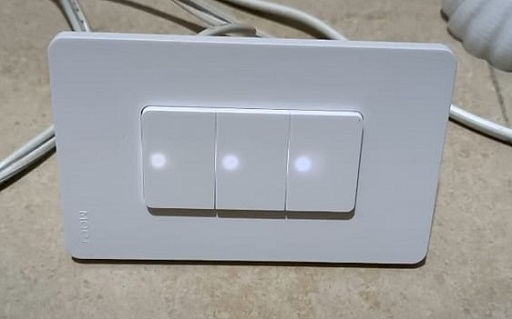

夜光狀態

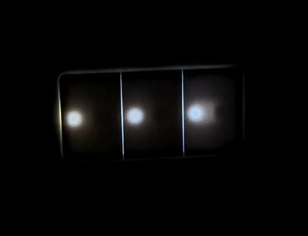

產品資訊

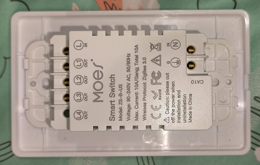

Z2M資訊

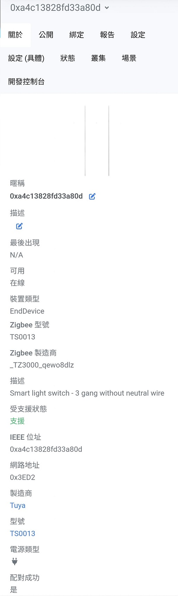

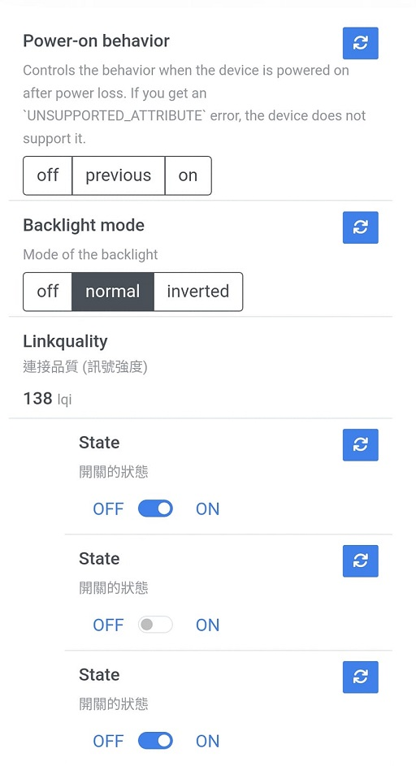

### 👍優點

- `價格取勝`

先不論穩定性，價格先贏一半！

- `磨砂材質耐髒美觀`

造型跟材質都滿好看的，老婆都說讚！

> 有網友反應塑膠材質感覺廉價，這個各位自行評估

- `可設定LED指示燈的顯示方式 (關閉/正常/反向)`

可以設定LED是要在開啟還是關閉時亮起，有更多的彈性可以滿足不同的需求，例如有些人可能認為指示燈啟動時要亮起才符合邏輯，不過有些人會認為要在黑暗中方便開燈，就是要關閉時亮起指示燈(就像星光開關的氖燈)，當然你也可以把指示燈顯示直接關閉。

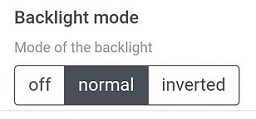

### 👎缺點

- `單零火通用無法作為zigbee中繼`

這點跟我原本的預期大相逕庭，本來是想要利用遍佈全家各角落的牆壁開關來當作訊號中繼，但這款無法做到。
不過也有前輩提醒牆內金屬盒可能會造成訊號衰減，牆壁開關可能不是理想的中繼裝置。

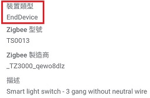

- `LED狀態燈太亮 (個人見解)`

我個人不喜歡這款LED狀態燈的設計，按鍵本身沒有做開孔，燈源是用透光的方式顯示，而且在黑暗中我覺得亮度太高了，反而有種廉價感，相較之下我覺得另一款的小孔LED更得我心，不過這個見仁見智。

- `鎖點螺絲偏短`

螺絲跟銅片之間有一點間隙，測試時(僅上電測試，沒接輸出)拿大約0.8mm的銅線插進去結果鎖不緊，不過實際應用上使用1.6mm的銅線應該是沒有問題的。

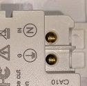

- `產品深度偏大`

此產品尺寸寬高深為`117.8*71.8*36`，要注意家中開關盒使用深度足夠。

> 實際入牆深度約28mm

- `產品預設安裝方向是直向`

外殼上面有小小的MOES字樣，而且要直向安裝才正確，不過字太小不起眼，我橫著裝其實也看不出差別

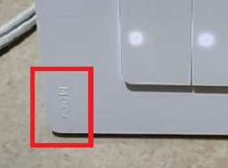

---

## zemismart智美智慧開關

外觀一覽

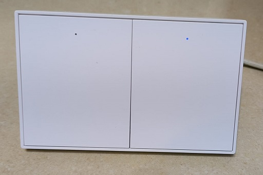

夜光狀態

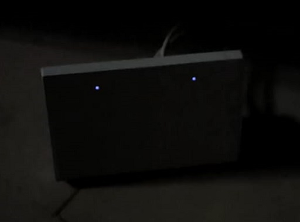

產品資訊

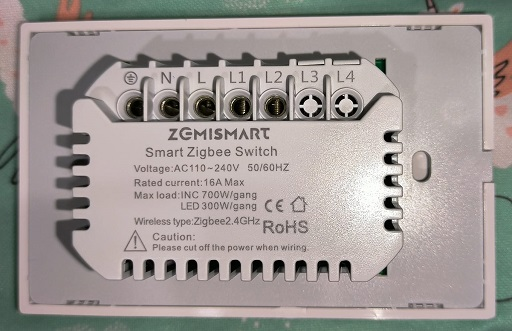

Z2M資訊

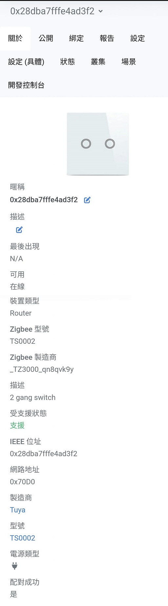

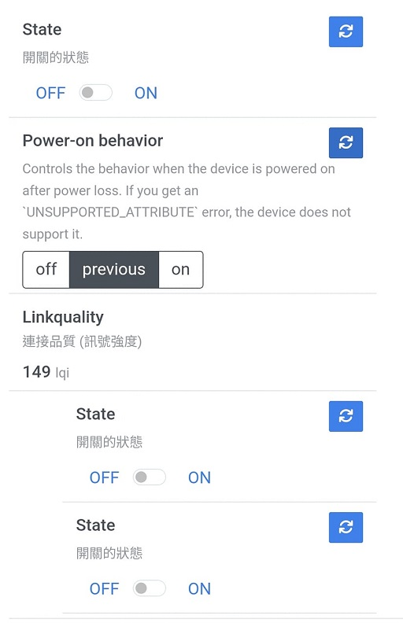

### 👍優點

- `外型美觀 (同時也是缺點，下面會講)`

類鋼琴鍵設計，我覺得很美，而且LED設計只有一小點藍光，相較MOES的開關我更喜歡智美這款的設計

- `訊號中繼功能`

這點完勝只能當作終端裝置的MOES開關，不過要注意訊號中繼功能是否穩定，也要考慮安裝處訊號干擾衰減的問題(例如金屬盒干擾)，我沒有做穩定性測試，各位自行評估吧。

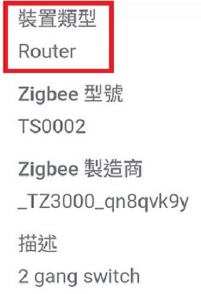

### 👎缺點

- `結構設計安裝不便`

這款開關的鎖點我到現在還沒找到，我猜測是要把按鍵本身拆除才能鎖螺絲(類似星光開關)。
而且我試著用手掰開發現很難打開，很怕大力出拉基，還是等有空先詳閱安裝說明書再說吧…

> 更新：背面處一側有個翹點如下圖，不是很好開

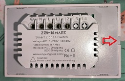

- `外觀設計不良 (老婆觀點)`

老婆：這什麼鬼東西，長得好像電鈴，不要把這種東西裝在家裡。

我：謹遵聖旨🙇

> 說個題外話，這是我目前找到唯一的118型又包含中繼功能的開關了… 還是想想其他中繼裝置吧…

- `無法設定LED狀態邏輯 (可能是版本問題)`

我直接透過Z2M接入HA後，並沒有像MOES那樣可以設定LED狀態邏輯(關閉/正常/反向)的選項，這款的邏輯就是反向觸發，關燈時亮LED燈，不過是有符合我自己的需求。

> 有網友反應其同款裝置有更多設定內容，包含LED狀態邏輯，可能是韌體版本差異

- `產品深度偏大`

此產品尺寸寬高深為116x72x35，一樣要注意尺寸。

> 入牆尺寸約25mm

---

## 免責聲明

本貼文沒有任何業配或推坑，純粹是個人經驗分享，高CP值的產品可能因為生產公差、用料、審美、個人運氣等因素導致每個人商品體驗不同，請謹慎評估後購買。