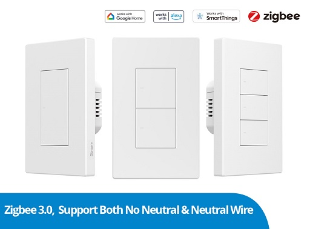
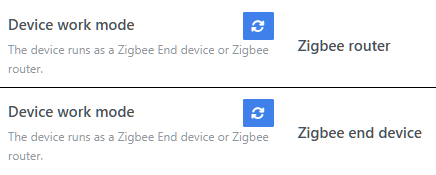

[🧾去選單](../../README.md)

> 發布於: 2025/6/25

# 居家Zigbee系列：最強Zigbee開關參戰！

## 目錄

- [快速總結](#快速總結)
- [優點](#-優點)
- [缺點](#-缺點)
- [商店](#-商店)
- [功能介紹及硬體拆解](#功能介紹及硬體拆解)
- [注意事項](#注意事項)

## 快速總結

SONOFF ZBM5回彈式牆壁開關

- 適用台灣118型開關
- 回彈式按鍵，最多三鍵
- 支援**解藕模式**
- 支援**多鍵觸發**
- 單火/零火通用
- 單火作為終端裝置（無中繼功能）
- **零火**可作為中繼器
- 零火可作為**中繼器**
- **零火可作為中繼器**
- （以上很重要說三次）
- 完整Z2M支援（v2.3.0含以上）
- 淘寶目前**沒有**官方通路

## 👍 優點

### 零火中繼功能

針對韌體特別調教

同時實現**單火終端**/**零火中繼**

根據配對時的狀態自動切換Zigbee屬性

> 如果有改接線方式，需要重新配對裝置

### 多鍵觸發處理

單火/零火都支援多鍵處理

在單火模式下測試三鍵版本

同時按下三個按鍵能正確處理

雖然每個按鍵切換之間有明顯延遲

仍贏過絕大部分無法處理多鍵的單火開關

請參考以下影片

https://github.com/user-attachments/assets/a44fcceb-9961-4e76-872f-fac356e19e24

> 為了凸顯按鍵開關指示燈，影片實施特殊色彩處理

### 支援解藕模式

...

## 👎 缺點

### 外觀笨重

...

## 🏪 商店

[現貨商品](https://myship.7-11.com.tw/general/detail/GM2406268597737)

...

## 功能介紹及硬體拆解

...

## 注意事項

...

## SONOFF官方賣場

- [官方商城點我](https://itead.cc/product/sonoff-switchman-zigbee-smart-wall-switch-zbm5/)

目前官方售價（僅供參考）

- 單鍵：US$24.9（約NT$747）
- 雙鍵：US$27.9（約NT$837）
- 三鍵：US$29.9（約NT$897）

如果從淘寶其他第三方賣場購買可能更便宜

至於是否為盜版貨源，或是買到客退品、整新品

各位可自行評估風險

## 免責聲明

本貼文沒有任何業配或推坑，純粹是個人經驗分享，高CP值的產品可能因為生產公差、用料、審美、個人運氣等因素導致每個人商品體驗不同，請謹慎評估後購買。

[🧾去選單](../../README.md)