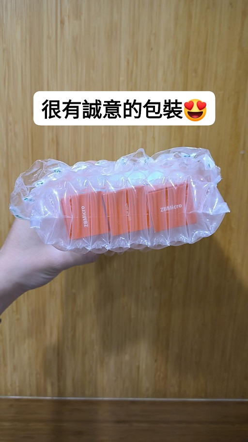
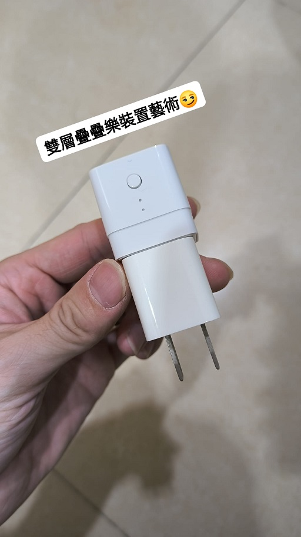
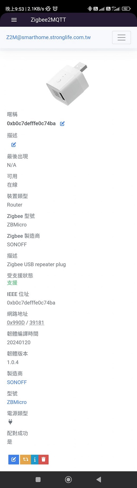
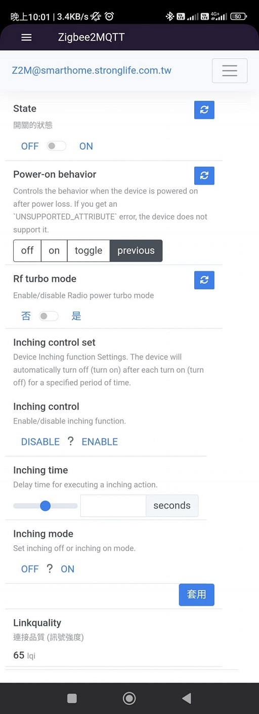

[🧾去選單](../../README.md)

> 發布於: 2024/10/26

# 居家Zigbee系列：SONOFF ZBMicro中繼訊號放大器

https://github.com/user-attachments/assets/6a2a11df-8eb6-43b3-b753-7fe86efd2dae

## 快速總結

- 開啟Turbo模式後有著變態驚人的訊號強度
- 可以控制USB電源通斷
- 支援USB 2.0資料透傳
- 支援最高36W QC3.0快充(供電端搭配快充充電器)

除了以上這些附加功能以外，作為專門的中繼裝置也足夠強大。

另外注意此設備輸入端是USB口，不是一般的AC 110V插座形式。

## 留意型號

SONOFF有一款舊版的WiFi版本，功能與價差甚大，請不要搞錯產品。

認明型號ZBMicro才是新的Zigbee中繼器，不要買到Micro。

### 官方資訊參考

- 型號`ZBMicro` - Zigbee 訊號中繼器

$12.9美金 (匯率32 約413台幣)

[官方連結](https://itead.cc/product/sonoff-micro-zigbee-usb-smart-adaptor)

- 型號`Micro` - WiFi USB通斷器

$6.49美金 (匯率32 約208台幣)

[官方連結](https://itead.cc/product/sonoff-micro-5v-usb-smart-adaptor)

## 👍 優點

- 超強訊號中繼

為規避各國法規限制，產品預設的射頻功率受限，但可以透過開啟Turbo模式實現超強訊號範圍，實測超有感。

- 支援最大36W QC3.0快充輸出

供電端可以搭配快充的USB充電器。

雖然官方標示僅支援QC3.0協議，但是我手上的PD 20W充電器，實測可以給手機充電功率到18W左右。

- 支援USB 2.0資料傳輸

此款不僅支援電源輸出，你也可以拿來做資料傳輸。

例如插在電腦的USB口上，輸出端可以連接USB2.0隨身碟，中間隔著ZBMicro電腦一樣能認到隨身碟，也可以遠端控制隨身碟插拔。

- 原生Z2M支援

Zigbee2mqtt原生支援一鍵加入無煩惱。

- 精美可靠的包裝

特別說一下SONOFF官方很可靠的包裝我的貨品。

用非常飽滿的空氣柱包覆商品，物流再怎麼暴力應該都弄不壞裡面的物件。如果你不是從官方商城購買，可能不會有如此用心的包裝服務。

> 哈迪商城也會盡量用心的幫各位包裝😏

## 👎 缺點

- 輸入端只有USB口可選

只能透過USB供電，沒有AC插座的選項。

如果你想要透過家裡的牆壁插座供電，你只能先插一個手機充電器，然後再插上ZBMicro，完成一個**雙層疊疊樂**裝置藝術。

- 預設的訊號功率被限制

法規問題，此產品初始狀態的功率被限制，要手動開啟Turbo模式設定，才能實現驚人的訊號中繼功能。

- 未知的訊號功率規格

為避免被各國政府查水錶，你在任何相關資訊中找不到Turbo模式的功率規格。

對於那些講究產品規格資訊的使用者來說，你很難判斷手上的產品訊號強度功能性是否有瑕疵。

## 🏪 商店

[現貨商城](https://myship.7-11.com.tw/general/detail/GM2406268597737)

SONOFF ZBMicro中繼訊號放大器少量上架！

## 正文開始

之前聽某些前輩分享，牆壁開關的Zigbee訊號中繼功能會受到壁內金屬盒的影響，導致訊號傳遞不佳。

後來自己安裝了具有中繼功能的牆壁開關後發現確實訊號傳遞不是很理想。

> 基於體感，非專業評測

再研究各種中繼方案之後，決定試著回歸初衷，讓中繼就做中繼吧！買一些迷你Zigbee中繼裝置到處插！

後來看到這位老外專業的評測，覺得SONOFF ZBMirco應該是不錯的選擇，價格比雜牌的略高但品質較有保障。

[原文章連結](https://smarthomescene.com/reviews/sonoff-zbmicro-usb-smart-adapter-review/)

這個外國人寫的評測都滿值得參考的，我自己都用瀏覽器英翻中，都還是看得懂，推薦大家看看！

- SONOFF ZBMicro Zigbee無線中繼器

[官方連結](https://itead.cc/product/sonoff-micro-zigbee-usb-smart-adaptor) 12.90美金 (不含運費)

這款型號是ZBMicro，另外還有一款基於WiFi的舊產品型號Micro，兩者價差非常大，功能也不同。

SONOFF Micro (WiFi)的官方售價是6.49美金，僅能透過WiFi控制USB通斷。

相較之下，ZBMicro有更多功能：

* Zigbee中繼裝置

轉傳Zigbee訊號，並且可開啟Turbo增強模式加強中繼功能，此功能主要是規避各國無線訊號法規而存在，實際上該模組的無線性能可以超越部分國家的法規限制，讓整體Zigbee網路更加穩定。

我在距離主機約6公尺的距離，中間有一堵輕隔間牆，測試開啟Turbo的訊號品質差距如下：
- 未開啟Turbo：65 lqi
- 有開啟Turbo：120 lqi

此數據可參考附圖，另外要維持良好的Zigbee訊號品質，每個產品之間的訊號強度應該維持`100 lqi`以上較佳。

另外我將開啟Turbo模式的ZBMicro跟相同位置的Zigbee牆壁插座進行比對，訊號品質差距如下：
- 某牌Zigbee牆壁插座：12 lqi (幾乎斷線)
- ZBMicro關閉Turbo：65 lqi
- ZBMicro開啟Turbo：120 lqi

訊號強度真的差好多，原本就已經比牆壁插座好了，打開Turbo模式是想讓我住在微波爐裡面嗎？

> 開玩笑的，功率再高也還是屬於低功率射頻產品

請注意，我這邊刻意讓牆壁插座連到遙遠的主機，原本中間是還有其他中繼的，平常能維持100以上的lqi。

但這邊可以發現，在相同位置做比較，被關在牆內的Zigbee中繼裝置 (插座、開關) 確實存在一定程度的**訊號衰減**。

所以裸露在外的Zigbee中繼裝置在訊號強度這塊有其優勢。

- 最高支援QC 3.0 36W快速充電

注意產品本身沒辦法將慢充直接轉快充輸出

> 仔細想想就知道是廢話

你的USB供電端必須接的是QC 3.0快充頭，ZBMicro本身可以協助傳遞最高36W的充電速率。

不過官方標稱支援QC 3.0協議，卻沒特別寫到PD協議。

我拿手上的PD 20W充電器給手機充電，實測功率大概也能跑到18W左右。

應該是也能支援20W以下的PD充電啦，至於更高瓦數的PD我手邊是沒有產品可以測試。

- USB 2.0資料透傳

可以實現資料傳輸，例如可以在電腦跟隨身碟之間插入ZBMicro，一樣可以讓電腦認到隨身碟。

但要注意只能支援USB 2.0的資料傳輸，如果你連接USB 3.0的隨身碟，那就只能跑在USB 2.0的速度。

此功能也能讓你更進一步無線控制隨身碟的通斷，例如離開電腦時關閉ZBMicro的輸出 (相當於隨身碟拔出)，但是你不需要實際拔掉隨身碟。

## 待改進的部分

吹捧這麼久，要來說說我認為產品需要加強的部分。

最大的問題是它的供電來源採用USB 5V供電，對某些人來說可能不是問題，但我家裡缺少直接的USB充電介面，最適合的地方只有一個帶USB輸出的小米快充延長線，插在上面比較不違和。

其他位置我都只能透過牆壁的110V插座供電，所以要先插一個手機充電器把110V交流電轉5V直流電，然後才能給ZBMicro供電，結果就是兩個疊加變成奇怪的雙層疊疊樂裝置藝術品，美觀性欠佳。

還有網路上找到一篇文章在討論ZBMicro應該拉長回報間隔的建議，後來在韌體版本`1.0.5`已經修復此問題，不過我仍保留在韌體`1.0.4`版本，似乎沒有遇到什麼狀況。

> 入手這款ZBMicro的夥伴們建議可以升級韌體到`1.0.5`

[原文章連結](https://forum.ewelink.cc/t/zbmicro-too-chatty/33366/21)

另外提一下產品尺寸是`33x31x26.5mm`，大概跟市面上最小的手機充電器差不多大，面積跟我的小米手錶螢幕也差不多，算是滿小巧的。

## Zigbee2mqtt

要讓ZBMicro進入配對模式，供電後長按側面按鈕約5秒，看到燈光閃爍後即進入配對模式。

Z2M裝置頁面截圖參考

Z2M會自動辨識到ZBMicro，如果沒有，請先嘗試更新你的Z2M到最新版本。

接入Z2M後可以看到以下公開功能：
- State：控制輸出通斷。
- Power-on behavior：斷電後復電的預設行為。
- Rf turbo mode：此裝置的精隨所在，趕快打開訊號加強功能，享受住在微波爐的快感吧！
- Inching相關：寸動相關功能，可以設定通電後多久自動關閉。
- Linkquality：訊號強度。

## 總結

我認為它是一款優秀的Zigbee中繼器，額外的附加功能也具有加分作用，產品可玩性提升不少，我未來會考慮將此產品佈置在家中各個角落。

如果你想要體驗這款產品，可以自行從[官方網站](https://itead.cc/product/sonoff-micro-zigbee-usb-smart-adaptor)購買。

或是從我的[哈迪現貨商城](https://myship.7-11.com.tw/general/detail/GM2406268597737)購買。

淘寶上也能找到一些比官網便宜的貨源，至少是否為正版或全新品，各位再請自行評估。

## 正版辨認

根據官方客服的消息指出

本體的USB輸出那一面有個QRcode

那是產品的**唯一序列號**

可以用來辨識正版

如果有疑慮的話可以提供給官方做確認

## 免責聲明

本貼文沒有任何業配或推坑，純粹是個人經驗分享，高CP值的產品可能因為生產公差、用料、審美、個人運氣等因素導致每個人商品體驗不同，請謹慎評估後購買。

[🧾去選單](../../README.md)