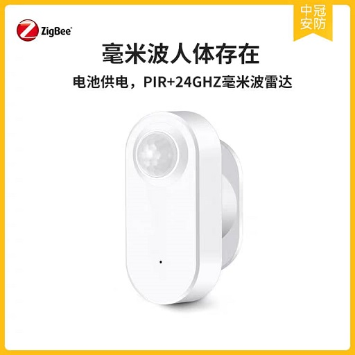
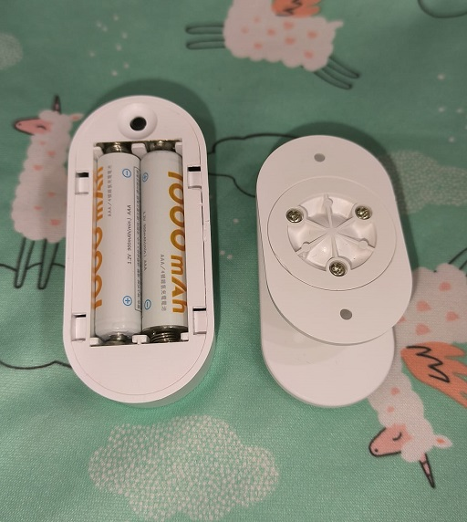
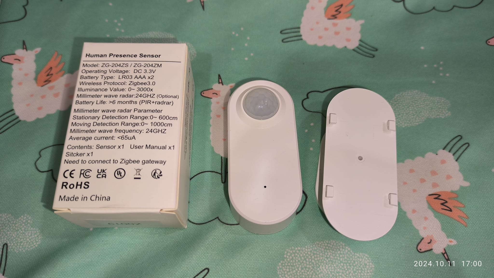
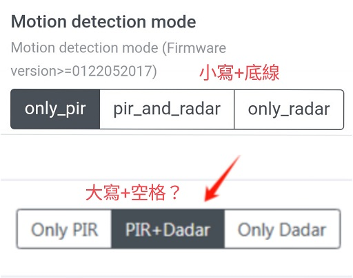

[🧾去選單](../../README.md)

> 發布於: 2024/10/12

# 居家Zigbee系列：(不推) 電池版人在感應

> (二更) 之前說產品正常的社員夥伴也被擊落了，賭徒們依照需要謹慎購買吧！

> (更新) 有社員回報同款產品使用正常，可能本人運氣不好，購買本款產品的勝率變高了，各位賭徒趕緊上！

## 快速總結

產品型號：`ZG-204ZM` 
- 毫米波
- PIR
- 光感
- 四號(AAA)電池x2

## 👍 優點

### 完美的設計發想

PIR常駐檢測，毫米波雷達休眠。

PIR觸發人在，毫米波開始檢測直到人消失。

利用以上機制達到節電效果。

### 電源線解放

透過兩節四號電池供電，不用外接電源。

解決以往陽台、浴廁不方便安裝人在感應器的問題。

### 不錯的電池續航

官方標稱可達**8個月**續航。

> 前提是雷達運作時間短

有興趣了解的見下文。

### 彈性的參數設定

可個別設定PIR跟雷達的靈敏度，還能設定運作模式，三選一「PIR+雷達」、「單獨PIR」、「單獨雷達」。

其中一個模組故障時，可以選擇剩下還活著的模組獨自運作(榨乾？)

### Z2M官方支持

一鍵加入Z2M

## 👎 缺點

### 不完美的韌體

產品運作不如預期，例如設定6米感應距離才能持續抓到3米左右的人。

有時感應到人後，已經離開了數分鐘，卻遲遲沒有反應觸發離場。

### 良率不妥

買了兩個產品，其中一個雷達是壞的。

### 有前提的附加功能

光感要在雷達工作時才會回傳。

雷達觸發時間短的情況下才能達到標稱續航。

## 正文開始

今天來分享一個故事

關於一款理想很豐滿，現實很骨感；

規格強大但實際體驗有點掉漆的夢幻裝置。

它就是*毫米波*+*紅外線*+*光感*+*電池供電*的`ZG-204ZM`

> 或是型號`ZG-204ZS`好像是一樣的東西

各位！電池供電的人在感應！很棒喔！

先別急著比讚，聽我娓娓道來…

我起初被燒到是因為以下老外的評測

[Zigbee Battery Powered Presence Sensor ZG-204ZM Review](https://smarthomescene.com/reviews/zigbee-battery-powered-presence-sensor-zg-204zm-review/)

在我還沒實際入手之前，認為它有以下優點：

* 24G毫米波雷達，實現呼吸等級的偵測，不怕大便被關燈。
* PIR輔助偵測，讓觸發時機比毫米波反應更迅速，同時提升電池續航 (下段說明)。
* 內建光感應器，回報照度，延伸更多應用。
* 電池供電！安裝地點完全解放！
* Z2M原生支援，無腦接入HA。

眾所皆知，毫米波/微波這類雷達人在感應幾乎都是電源供電，因為雷達模組本身比紅外線耗電非常多，一般PIR感測器號稱有2年續航力，如果換成雷達模組大概撐不到1個月。

至於這款產品為什麼可以用電池供電，就是因為它內建兩種人體感應，平常會用PIR持續偵測，當PIR感應到人時，會喚醒睡眠中的毫米波雷達來接手偵測人在狀態。

因此在正常使用情境中，大部分時間是PIR在工作，所以號稱電池壽命可以來到8個月，不得不說這個設計真是妙哉。

這裡有個細節，所謂正常情境，必須是你安裝的地方不是人會常在的位置，例如陽台、廁所這類每天有人的時間不長的環境就適用。但是如果你裝在主臥室，等於一天中至少有8小時(假設你是個睡眠乖寶寶)的時間雷達是不停在運作的，耗電量可想而知。就算你安裝在廁所或陽台，但如果該區域是辦公室，人物進出頻繁；或是你是個蹲馬桶小時起跳的男人，那電池續航力也會大大縮水。

總之，請**不要**讓雷達運作太久。

## 光照感應器

該裝置確實會回傳光照度，但是有個前提，只有在毫米波雷達工作的時候，才會回傳照度。

這點可以理解，是為了提升續航才這麼做，但是這樣的使用情境對我而言，完全就是雞肋，畢竟我在設定自動化，人在觸發時要做甚麼的當下，我就要先知道周遭光線如何，才能進行下一步例如開燈等動作，然而我目前測試下來，光線數值回傳的時間點總之慢於雷達反應。

再者，要省電的話也可以至少一分鐘回傳一次光照度吧？這就要看後續韌體有沒有機會改善了。

接著講個在接入Z2M時發生的玄學，「運作模式」設定無法正常使用，出現在Z2M設定上的運作模式共有三個選項：
- Only PIR (紅外線單獨運作)
- PIR + Radar (混合式)
- Only Radar (雷達單獨運作 -- 簡直電池炸彈…)

正當我興高采烈的要測試三種模式時，發現每個選項設定下去都報錯。

在log裡排查了很久發現是字串不合法，合法字串如下：
- only_pir
- pir_and_radar
- only_radar

仔細看，大小寫、底線、符號都有點不一樣，我小腦袋飛速運作，思考問題出在哪裡，畢竟我拿到裝置後，打開Z2M配對，啥也沒動，他就全自動接入了啊…

後來重新解除綁定又配對幾次都無解，我去問了官方，他們回應幫我在工廠裡測試樣品沒遇到這個問題，我就想說摸摸鼻子算了，不能改模式就不改吧，預設PIR+雷達混合式理論上也是最完美的狀態。

結果，隔一週我心血來潮又重新綁定一次，問題竟然自動消失了，什麼大寫的PIR跟空格就跟沒出現過一樣的消失了，出現在Z2M上的選項就是正確的全小寫+底線格式，我至今沒有想通，環境一模一樣，甚至HA跟Z2M版本都沒更新過，怎麼就突然好了。

## 穩定度跟良率

我買了兩顆裝置，其中一顆雷達是**壞的**！

真的是幸好我買了兩顆，不然我直接斷定此產品是垃圾，因為其中一顆我把雷達靈敏度調最高，然後感應器直接貼臉上，短短幾秒，這玩意當著我的面從有人變成沒人，我才想說這什麼垃圾東西… 

結果拆開第二顆來測試，哇喔是好的，原來**第一顆是故障**的。

另外產品穩定度有待商榷，我把雷達靈敏度調4米左右，他無法有效的持續偵測約3米左右的人，我把靈敏度調高到6米，似乎就可以持續偵測到實際3米的距離。

另外偵測到人之後經常卡住，裝置持續沒有回傳更新數據，導致人已經走了，沙發已經涼了，感測器仍然顯示有人在，通常10幾分鐘後才會突然恢復無人狀態。

以上現象看起來是裝置沒有回傳數據，因為我在應該無人的時候持續觀察裝置各項數據，會發現鏈路品質也遲遲沒有更新。

內容太長，還沒談到Z2M參數以及電路板的拆解，不過我黑成這樣，也許各位也不想聽這些細節了吧，畢竟都不想買了。

如果很多人敲碗的話，我再來分享以上資訊吧！

## 免責聲明

本貼文沒有任何業配或推坑，純粹是個人經驗分享，高CP值的產品可能因為生產公差、用料、審美、個人運氣等因素導致每個人商品體驗不同，請謹慎評估後購買。

[🧾去選單](../../README.md)