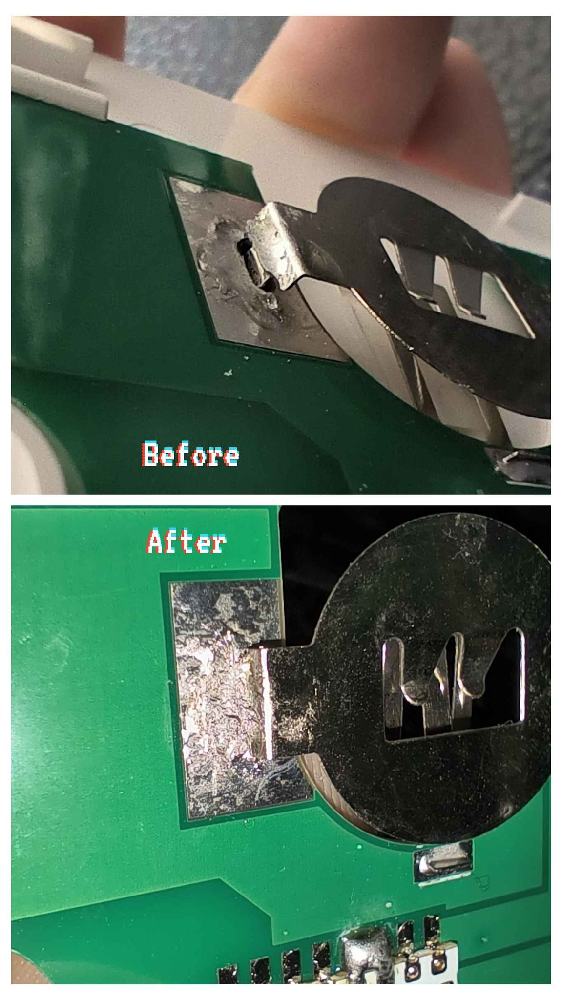
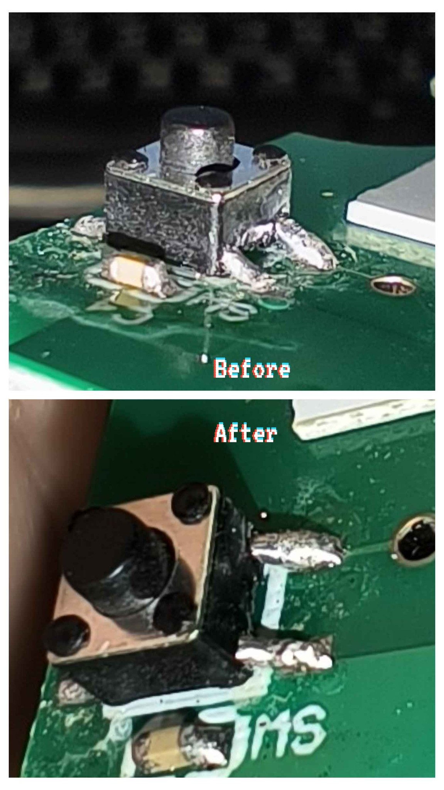
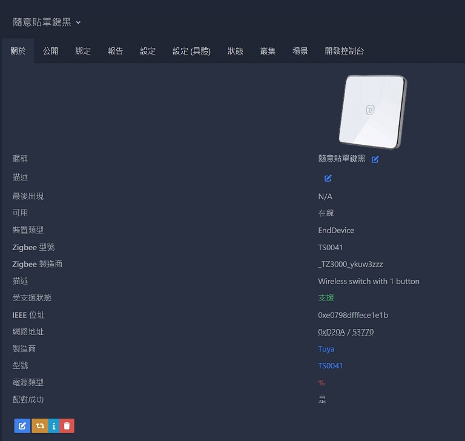
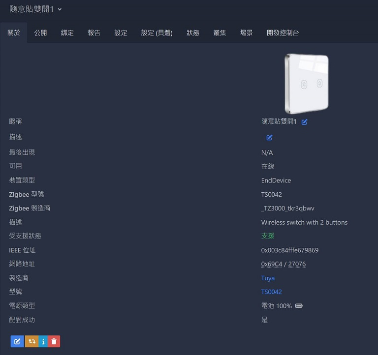
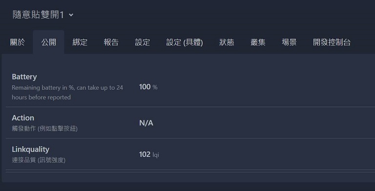

[🧾去選單](../../README.md)

> 發布於: 2024/10/18

# 居家Zigbee系列：(不推) 白牌隨意貼開關

## 快速總結

未知品牌的塗鴉Zigbee隨意貼開關

> 隨意貼是指可以隨便放在各種角落的電池類無線開關

CR2032電池供電

## 👍 優點

### 便...便宜?

價格取勝! 一個淘寶購入成本台幣300內有找!

### 隨附一個CR2032電池

買產品時就提供一個電池，跟大部分其他感應器電池同款CR2032。

### 支援多種按鍵模式

單擊、雙擊、長押(3秒)，判斷還算精準，但長押過久會變成配對模式，請自行訓練肌肉記憶💪

### Z2M官方支持

一鍵加入Z2M

## 👎 缺點

### 老舊款式已停止生產

你現在還能買到這款骨灰級產品，大機率已經在倉庫放10年了

### 良率極差

買了兩個，兩個都是故障 (後來自己修好了，見下文)

### 手感不佳

裡面用低成本微動，加上鐵片回彈式外殼按鍵。

你沒摸過，我無法形容，總之我很不喜歡那個觸感。

### 沒有LED指示燈

操作按鍵時沒有任何指示燈，但是模具上有開一個LED燈的小洞...

### 電池更換困難

這款設計要拆殼換電池，而且退出電池的難易度超高，並且有一定危險性，務必使用一字起子等工具避免受傷。

## 正文開始

哈迪今天又來**反推**一款產品，給予各位未來選購產品時參考。

它是一款未知品牌的隨意貼開關，你可以參考此貼文的附圖，在淘寶上可以找到一模一樣的產品，售價約台幣200多元。

如果你有良好的運氣，高超的動手能力，喜歡復古美感，且正在尋找便宜堪用的隨意貼開關，那這款商品一定適合你！

讓我來進行流水帳式說明：

我這次購買了一款單鍵版本、一款雙鍵版本，共兩個隨意貼開關。

下單後客服通知白色缺貨，所以我兩款都同意改發其他顏色，單鍵發黑色、雙鍵發灰色。

產品到手後，採用非常簡陋的硬紙盒包裝，上面沒有任何規格及型號標示，打開裡面的說明書是`單火開關`、`零火開關`、`智能插座`的**共用**說明書。

> 等等... 請問這跟我買的隨意貼開關到底有什麼關係阿！

產品採用CR2032電池，並且內建了一個電池，我認為是個加分點，因為我手邊許多其他電池感應器也都用CR2032，以後不用準備特規電池，而且產品隨附一個電池，讓我不用再出門買電池。

如果你覺得我講的是廢話，抱歉，因為這款產品我找不出什麼優點了...

關於電池，同時我也發現了一個缺點，我買了兩個隨意貼，一個電池有封膜保護，就是初次使用前要抽掉封膜才開始過電。

但是其中一個沒有封膜，導致放在裡面的電池早就放電光光，我後來配對一直失敗，詢問原廠技術人員表示應是電池耗盡，是這款產品的常見問題之一。

> 你還敢說阿！給我沒電的電池幹嘛！

接著我檢視產品外觀，外殼是全塑膠的，正面有不錯的磨砂感，按鈕採用回彈式，但是按起來手感不好，按壓需要明顯施力，像是夜市賣的玩具。

之前有前輩分享MOES牆壁開關按起來像廉價玩具，啊哈！跟這款比起來根本小巫見大巫。

關於手感不好的原因，我得出的結論有二：

1. 廉價微動開關，本身就不太好按。
2. 拆開按鈕後發現回彈機制不是彈簧，而是一個簡易的鐵片，該鐵片在正常情況下會撐起按紐，按下按鈕時施力必須足夠讓鐵片彎曲。

https://github.com/user-attachments/assets/ad97f533-8d2b-4fd7-ba1d-bc087d0a337f

繼續看下去，外殼按鈕正面下方明顯有給LED燈開一個孔，但是我在任何情況下都不見它發光。

後來拆開檢視電路板，對應的位置實際沒有任何LED料件，取而代之的是在一個奇怪的地方上了一顆白光LED (參考上方影片)。

作動時它確實會發光，並且無論你買幾個鍵，電路板上都只有那**一個**LED燈，所有按紐按下時它都會發光。

**只是外殼蓋上後你看不見它**

準備上電，結果兩個隨意貼都有故障，排除問題的心路歷程我就不贅述了，我遇到了以下問題：

### 單鍵版本無法配對成功

長押按鈕進入配對模式，LED會閃爍，但很快就熄滅，後來客服回應是**沒電**了，正常情況閃爍會持續很久的，短暫閃爍表示電池電壓不足。

### 電池座焊點脫落

更換電池後，依舊無法成功配對，我直覺是開關一下有電一下沒電，後來發現電路板上的電池座焊接點已經脫落，手動補焊後產品就正常了。

### 雙鍵其中一邊按鍵故障

雙鍵開關一開始就能配對成功，但是左鍵按了沒反應，並且電路板上的LED燈也沒有亮起，後來技術人員遠端判定是單顆鍵故障。

我試著檢查微動開關四個腳位的過電狀況，發現其中一支腳未正常通電，肉眼看不出但應該是空焊，一樣補焊後按鍵就正常了。

## 開箱小結

此開關在我手上不良率是100%，我下次不會再買。

即使自己有機會修復，但這次是我運氣好有找到問題。

並且客服有說明此款產品是非常老舊的款式，早已停產了。

現在買到的產品可能是在倉庫躺了10年以上的庫存品。

換個角度想，你可以用很便宜的價格取得這些上個世代的產品。

如果你只是想要一個便宜堪用的隨意貼，盡早購買，售完為止！

## Zigbee2mqtt

解決了硬體問題，終於可以說說它在Z2M上的表現了。

單鍵版Z2M資訊

雙鍵版Z2M資訊

只有簡單的三個節點：

* action: 動作，單鍵雙鍵不一樣。
1. 單鍵版: "" (空字串) / single (單擊) / double (雙擊) / hold (長押)
2. 雙鍵版: "" / 1_single (1表示左鍵) / 1_double / 1_hold / 2_single (2表示右鍵) / 2_double / 2_hold
* battery: 電池電量，但我很懷疑它能反應實際電量。
* linkquality: 連線品質

電池電量一開始是null，可能要放超過一天才會開始回報電量。

action平常都是空字串""，你按下開關的瞬間會發一個指定action，然後瞬間又變成空字串，所以你透過Z2M的介面是看不到action內容的，馬上又會被空字串覆蓋。

後來發生了一件搞笑的事情，我在測試長押動作，結果押太久變成配對模式，我的隨意貼就這樣從Z2M中離家出走，重點是外觀上沒有LED燈輔助，你根本不知道長押多久算動作、多久會進入配對模式。

唯一的解決方法，就是練到你的手產生肌肉記憶，長押動作觸發後手會自己放開就行了，很簡單吧。

## 總結

撇除你運氣差買到瑕疵品，它與Z2M穩定連接，並且對於單擊、雙擊、長押，目前沒有發現漏傳狀況。

如果你想要一個便宜的隨意貼產品，依需求及動手能力謹慎購買，並且下單前一定要跟客服確認庫存。

我打算尋找其他更美觀的平價隨意貼開關。

## 免責聲明

本貼文沒有任何業配或推坑，純粹是個人經驗分享，高CP值的產品可能因為生產公差、用料、審美、個人運氣等因素導致每個人商品體驗不同，請謹慎評估後購買。

[🧾去選單](../../README.md)