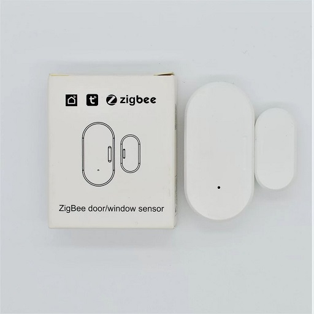
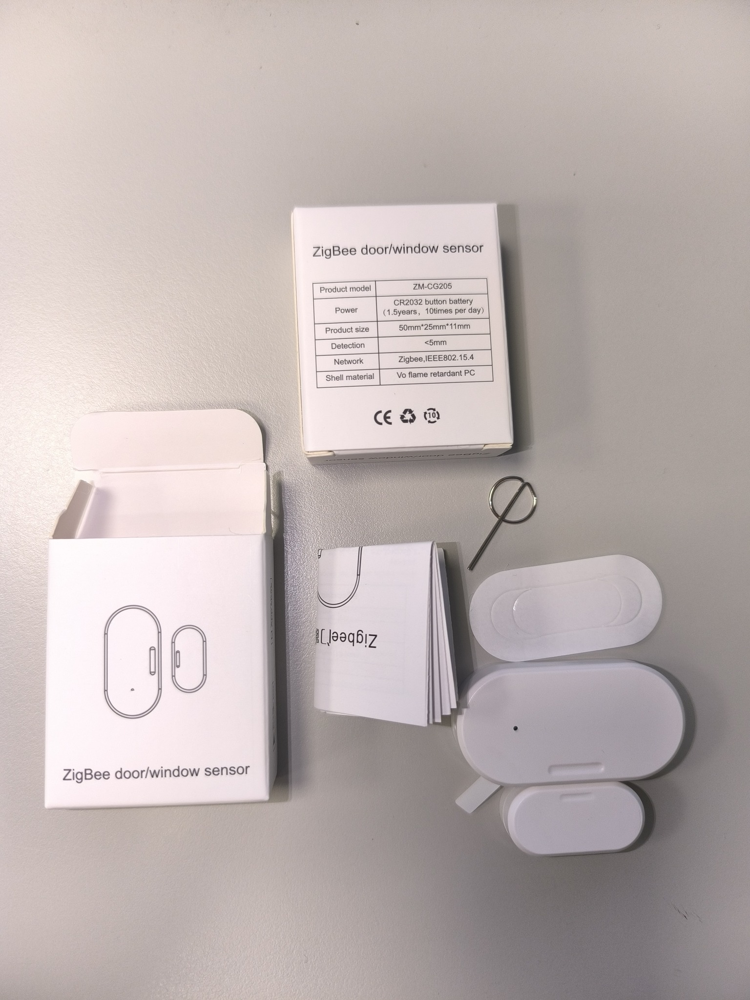
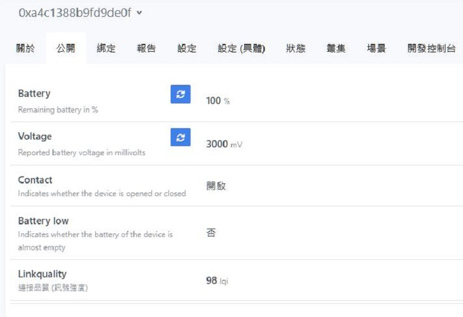

[🧾去選單](../../README.md)

> 發布於: 2025/1/23

# 居家Zigbee系列：白牌門窗感應器

## 快速總結

`執夢智能`Zigbee門窗感應器

CP值王者。

家裡安裝三個門磁約半年時間，目前沒有遇到任何問題。

採用`CR2032`電池，號稱`1.5年`續航 (每日開關10次)。

原廠有做好電池隔離，入手時不需更換電池。

產品本身需要用隨附的3M雙面膠固定。

我認為原廠稱1.5年續航可能實際上沒辦法撐那麼久。

建議在約30%電量就更換電池，避免低電量造成的使用者體驗問題。

> 註：執夢智能其他產品尚未有使用經驗，請勿將單一產品體驗與整體品牌印象畫上等號。

> (2025/2/15更新) 家裡最頻繁使用的玄關門，因為家中5位成員會在不同時間段出門/返家，每日開關門次數約10～20次不等，使用半年後目前電量剩下50%，給各位參考。

## 👍 優點

### 超低價格

淘寶價約人民幣$39

換算台幣約NT$180

### 穩定工作

半年來沒有發生異常延遲或斷線的狀況

觸發反應時間雖然沒有到超快速

但作為開燈自動化穩定使用目前很滿意

### Z2M原生支援

可直接接入Z2M

## 👎 缺點

### 尺寸外觀

受限於此世代的技術

目前門磁的尺寸是通病

如果沒有用一些手段去隱藏

門磁感應安裝在門上會很顯眼

### 無註明防水

此產品無註明可防水

安裝地點一定要慎選

例如不可安裝在窗戶外側會淋雨的位置

或是門下可能會被拖把、雨傘弄濕的位置

### 觸發延遲

這款開關觸發事件似乎有一丁點延遲

但是沒有到秒級別，體感上不到1秒

可能是體驗與續航的平衡取捨

### 產品圖文

很簡陋的產品介紹

甚至沒有精美主圖

直接拿白背景拍產品當主圖

第一眼真的會害怕這種產品

## 🏪 商店

[現貨商品](https://myship.7-11.com.tw/general/detail/GM2406268597737)

> 已售完 

極少量現貨釋出，手速不夠快可以去下方預購搭順風車，要等一個月左右。
有一個福利品，拆蓋不慎，一字型凹槽有磨損，但不影響整體外觀。

[預購商品](https://myship.7-11.com.tw/general/detail/GM2411287898818)

> 名額已滿

搭哈迪下次集運的順風車

等待時間約1個月左右

預購數量有限售完不補

## 正文開始

今天介紹一款白牌門窗感應器

原本是不打算再介紹白牌產品

但家裡佈置的三組門磁已經**穩定工作半年**

半年來也從來沒有長時間延遲或斷線

目前產品良率是**驚人的百分之百**

截至目前原廠電池都還有90%以上電力

體驗相當良好因此分享給大家

品牌名稱應該是叫做`執夢智能`

包裝上的型號是`ZM-CG205`

淘寶購入成本大概**台幣180**左右

相較於市面上其他品牌的門窗感應

價格可說是極具競爭力

其他品牌Zigbee門窗感應器價格參考：

- `AQARA` MCCGQ11LM - 米粉生活 $315
- `SONOFF` SNZB-04 - 台灣智能感測科技 $490
- `VIZO` VZ-DWS - 官方蝦皮 $495

有一款便宜又穩定的門磁

夫復何求，足以。

產品採用CR2032電池

號稱是1.5年才需更換電池

> 假設每天開關10次

原廠已經附贈一顆電池

更棒的是有做好電池隔離

不用擔心拿到手的電池已經沒電

入手後只要把墊片抽出即可使用

但是那個墊片不好抽

可以試試左右橫擺搖晃抽出

如果墊片還是卡住抽不出來

等等下方會說明如何打開外殼

## 電池續航迷思

實際上可能電池無法撐到1.5年

原廠是計算電容量耗光的時間

但產品在電量30%以下預期會出現各種問題

我個人會建議在30%左右就更換電池

這樣才不會影響使用體驗

畢竟CR2032電池很便宜的

就不要堅持客家精神了吧！

## 配對與重設

外殼上有個紅色LED指示燈

配對模式時會持續閃爍

開關事件發生時會閃一下

側邊有個重設小孔

已經配對的情況下

用任意SIM卡針戳入**長押5秒**

長押過程中會亮著紅燈

等紅燈開始**持續閃爍**

就代表已進入配對模式

操作影片如下

https://github.com/user-attachments/assets/9b52335c-2b1c-4669-91dd-2468ea17a346

## 更換電池

重設孔的旁邊有一條凹槽

可以用一字起子翹起外殼

更換電池需要按上述方式打開

操作影片如下

https://github.com/user-attachments/assets/1e24d9b0-149b-4e1d-b613-1a6839f42730

## 盒裝內容

- 本體與磁鐵一對
- CR2032電池一顆 (已安裝)
- 說明書一份
- 3M雙面膠一組
- SIM卡針一支 (重置用)

## 如何安裝在門上

產品隨附一組3M雙面膠

已經開好正確尺寸

也有做割線方便一分為二

我們需要將雙面膠拆成內外兩圈

外圈用來固定較大的門磁主體

內圈用來固定另一個開合磁鐵

兩者的正面對接側有標示

將兩個標示處對準安裝即可

另外感應距離約1公分

保留一般門縫的寬度也能感應到開關門

## 接入Z2M的方式

第一次使用直接拉開電池墊片即可進入配對模式

或是使用SIM卡針戳入本體的重設孔約5秒

看見紅燈閃爍就代表配對模式啟動

另外該產品在Z2M中的型號目前已知有兩種

某一批購買的門磁感應被認作`eWelink ZNZB-04`

另外還有一批則是認作`Tuya TS0203`

兩者都能直接接入Z2M使用

沒有什麼太大差別

主要公開內容如下：

- Battery: 電量 (0~100%)
- Voltage: 電池目前電壓. 越低表示電量越少 (3000 mV以上滿電)
- Contact: 開合狀態 (開啟/關閉)
- Linkquality: 連線品質, 越高越好 (0~255)

## 如何自行購買此產品

請認明`執夢智能`品牌關鍵字

或使用下圖去淘寶以圖搜圖

但請注意自行承擔買到仿冒品的風險

建議直接找淘寶`伊奧尼亞旗艦店`店鋪

該店家已確認是原廠的供應商之一

## 免責聲明

本貼文沒有任何業配或推坑，純粹是個人經驗分享，高CP值的產品可能因為生產公差、用料、審
美、個人運氣等因素導致每個人商品體驗不同，請謹慎評估後購買。

[🧾去選單](../../README.md)