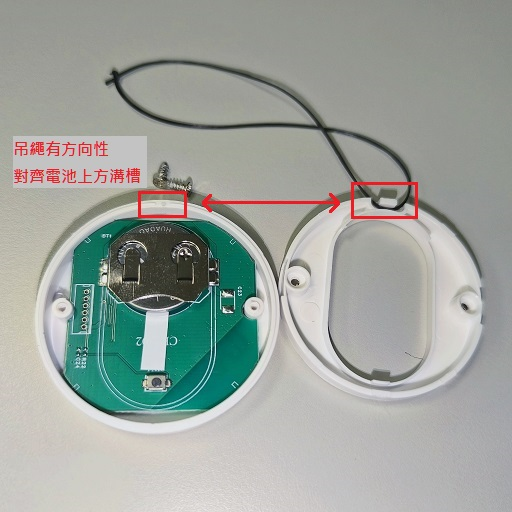

[🧾去選單](../../README.md)

> 發布於: 2025/9/30

# 居家Zigbee系列：白牌Zigbee無線按鈕

## 目錄

- [快速總結](#快速總結)
- [優點](#-優點)
- [缺點](#-缺點)
- [商店](#-商店)
- [開啟外殼後蓋](#開啟外殼後蓋)
- [配對與重設](#配對與重設)
- [更換電池](#更換電池)
- [電池續航迷思](#電池續航迷思)
- [盒裝內容](#盒裝內容)
- [如何安裝掛繩](#如何安裝掛繩)
- [接入Z2M的方式](#接入z2m的方式)
- [如何購買此產品](#如何購買此產品)

## 快速總結

外殼非常眼熟（公模）的一款Zigbee無線單鍵按鈕

簡單好用的開關，採用`CR2032`電池，官方稱待機`1年`以上

原廠有做好電池隔離，入手時不需更換電池

觸發事件支援`單擊`、`雙擊`、`長按`三種

淘寶還未上線的新品，可接入Zigbee2mqtt

!!! **淘寶沒有上架** !!!

!!! **淘寶沒有上架** !!!

!!! **淘寶沒有上架** !!!

以圖搜圖會找到很多類似產品

因為外殼是公模，各家的外觀都長一樣的

產品本身固定方式可選

- 隨附3M雙面膠
- 隨手放桌面
- 自行加裝吊繩（有預留溝槽）

**沒有**磁吸功能，有需要的話可以自己貼軟磁鐵

建議在約30%電量就更換電池，避免低電量造成的使用者體驗問題

## 👍 優點

### 外觀造型

按鈕採用一個藍色圓環設計

藍環屬於純造型不會發光，看上去有質感加分

### 手感加分

拆解圖可看到按鍵模組有用上膠墊

雖然實際觸發是用平價微動開關

但膠墊一定程度的模擬出回彈的感覺

並不是說有多高級的按鈕回饋質感

但是花小錢辦大事，CP值超高

### 超低價格

此產品原廠未在淘寶上架

我會放在[預購商城](https://myship.7-11.com.tw/general/detail/GM2411287898818)（單入`NT$199`）

是跟同一個廠家購買的，保證貨源

或是找淘寶其他同款約`人民幣¥25~¥45`

便宜治百病，白牌產品的最大優勢

相較其他一線品牌如SOxxOF、VIxO便宜很多

當然大品牌有其成熟設計、產線、品管、營運成本

售價及產品細節當然是不可比擬的

> 小米算是特例，無線開關也是很便宜，本來想買但我看評價兩極...

### 獨立配對按紐

一把雙面刃，我認為利大於弊，歸類在優點中

重置配對按鈕需要打開後蓋去押`SW4`按鈕

最大的好處是不會跟`長押事件`衝突

壞處就是重新配對方法不夠直覺

但初始情況下拔掉電池墊片會自動進入配對模式

只有在特殊情況要手動重新配對時需要記得方法

### Z2M原生支援

可直接接入Z2M

## 👎 缺點

### 購買渠道不便

產品沒有在淘寶上架

可以找同樣外觀的替代產品

例如冬瓜智能的同款，價格也不貴

但使用體驗不保證完全相同

或是在[哈迪預購商城](https://myship.7-11.com.tw/general/detail/GM2411287898818)下單同款

是跟同一個廠家購買的，保證貨源

### 觸發延遲

這種無線開關的通病

觸發事件有秒級別的延遲

因為要支援`單擊`、`雙擊`、`長按`事件

韌體要判斷以上三種事件類型

沒辦法在壓下去的瞬間發出事件

### 僅單鍵版本

圓形按鈕設計上只有單個按鍵

如果需要雙鍵以上的請參考其他產品

或是部署多個無線按鈕（反正便宜，但占空間）

### 無註明防水

此產品無註明可防水

使用地點要慎選

## 🏪 商店

[現貨商品](https://myship.7-11.com.tw/general/detail/GM2406268597737)

（已售完）

哈迪預留自用以外，釋出兩個給夥伴們玩看看

附上自製彈力吊繩，不要的話可以剪掉

手速不夠快可以去下方預購搭順風車，要等一個月左右

[預購商品](https://myship.7-11.com.tw/general/detail/GM2411287898818)

等待時間約1個月左右

預購數量有限售完不補

## 正文開始

介紹一款外觀不錯的Zigbee無線單鍵按鈕

整體外觀用的是藍環設計的公模塑膠外殼

https://github.com/user-attachments/assets/a910424b-36ac-4ec0-be5a-d9d633f81d6f

特別的是淘寶沒有渠道可以直接購買此款產品

淘寶其他同款競品價格約落在`人民幣¥25~¥45`左右

原廠還未針對此產品重新設計包裝

用的是其他無線開關的盒裝

**外盒的產品規格標示與實際產品對不上**

> 例如外盒電池規格寫CR2450，但實際上是CR2032

不過白牌產品就不要計較太多了

相較於市面上其他品牌的無線按鈕

價格可說是極具競爭力

其他品牌Zigbee無線單鍵按鈕價格參考：

- `AQARA` AK010UEW01 - 賈維斯 **NT$649**
- `SONOFF` SNZB-01P - 台灣智能感測科技 **NT$510**
- `VIZO` VZ-SS1 - 官方蝦皮 **NT$630**

> 大品牌有其成熟設計、產線、品管、營運成本，不可單方面以售價評估其價值

產品採用CR2032電池，官方稱待機續航1年以上

原廠已經附贈一顆電池，有做好電池隔離

不用擔心拿到手的電池已經沒電

入手後只要把墊片抽出即可使用

不過要先打開後蓋，而且很難無損開啟

等等下方會說明如何打開外殼

## 開啟外殼後蓋

外殼的側邊有兩個一字凹槽（3點鐘、9點鐘方向）

拿盡量大號的一字起子去撬開

第一次開蓋會很困難，免不了會傷到便宜的塑膠殼

請花點耐心兩邊來回撬動，有志者事竟成！

打開之後就會看到電池及配對按鈕

## 配對與重設

外殼上有個紅色LED指示燈

配對模式時會持續閃爍

開關事件發生時會閃一下

電池上方有個`SW4`配對按鈕

已經配對的情況下**長押3秒左右**

長押過程中會亮著紅燈

等紅燈開始**持續閃爍**

就代表已進入配對模式

## 更換電池

電池移除有難度，如果真的推不出來，試試以下方法

> 小心如果拿一字起子等金屬物，不要短路到電池正負極

## 電池續航迷思

標稱電池續航力與實際情況可能有差距

原廠是計算電容量耗光的時間

但產品在電量30%以下預期會出現各種問題

我個人會建議在30%左右就更換電池

這樣才不會影響使用體驗

畢竟CR2032電池很便宜的

就不要堅持客家精神了吧！

## 盒裝內容

- 開關本體
- CR2032電池一顆 (已安裝)
- 3M雙面膠一組

## 如何安裝掛繩

產品有預留掛繩溝槽

如果你想要搭配掛繩使用

需要拆除第二層背蓋如下圖

## 接入Z2M的方式

第一次使用直接拉開電池墊片即可進入配對模式

或是長按電池上方的`SW4`按鈕約3秒

看見**紅燈閃爍**就代表配對模式啟動

支援Zigbee2mqtt，辨認型號為`CK-TLSR8656-SS5-01(7000)`

Z2M產品說明文件參考

https://www.zigbee2mqtt.io/devices/CK-TLSR8656-SS5-01(7000).html

主要公開內容如下：

- Battery: 電量 (0~100%)
- Voltage: 電池目前電壓. 越低表示電量越少 (3000 mV以上滿電)
- Action: 事件狀態 (single/double/long)
- Linkquality: 連線品質, 越高越好 (0~255)

> 注意：Action狀態轉瞬即逝，正常在畫面中看不到Action改變是正常的，如果遇到問題可以透過LOG去分析

## 如何購買此產品

在[哈迪預購商城](https://myship.7-11.com.tw/general/detail/GM2411287898818)下單同款（單入售`NT$199`）

或使用下圖去淘寶以圖搜圖

但請注意買的是其他競品，此款原廠並未在淘寶上架

## 免責聲明

本貼文沒有任何業配或推坑，純粹是個人經驗分享，高CP值的產品可能因為生產公差、用料、審美、個人運氣等因素導致每個人商品體驗不同，請謹慎評估後購買。

[🧾去選單](../../README.md)