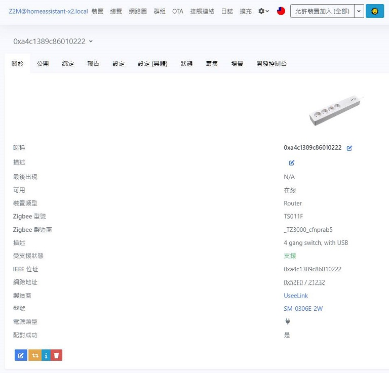

[🧾去選單](../../README.md)

> 發布於: 2024/11/15

# 居家Zigbee系列：塗鴉Zigbee延長線

## 快速總結

台灣適用的Zigbee延長線，具有Zigbee中繼功能，延長線的產品特性可做為優秀的訊號中繼站。

最大安全電流15A，內建USB輸出支持最高`PD 20W`快充，不含本體線長1.5m。

可惜的是**不具備**電量統計功能。

產品各孔位接合緊密，插座夾力調整得恰到好處，便宜的塑膠外殼算是小缺點。

接口非常豐富：
- AC插座 x4
- USB Type-A 5W標準輸出 x2
- USB Type-A QC 3.0 18W快充輸出 x1
- USB Type-C PD 20W快充輸出 x1

具備USB Type-A、Type-C輸出，最高支援PD 20W快充。

AC每個孔位可透過軟體獨立控制通斷，全部USB在軟體上共用一組通斷。

可接入Z2M，另外產品外殼直接標明ZHA、Z2M支援，非常奇妙。

自行購買時請認明型號與功率，不同規格的價差非常大，善用Zigbee 16A PD20W等關鍵字。

### 👍優點

#### 台灣規格適用

使用台灣標準的三孔美規插座接頭，與賣家確認電壓支援AC 95～240V 50/60Hz，測試可正常使用變壓器、吹風機等電器。

> 使用電器時請勿超過安全功率及電流

#### 安全認證

盒裝上有標示產品通過`美國ETL認證`，安全有保障。

#### 穩定的Zigbee訊號中繼

正常環境下延長線本身周圍無遮蔽或干擾，可以做為良好的訊號中繼站，實測訊號傳遞效果不錯。

#### 豐富的USB輸出口

延長線接口如下
- AC插座 x4
- USB Type-A 5W標準輸出 x2
- USB Type-A QC 3.0 18W快充輸出 x1
- USB Type-C PD 20W快充輸出 x1

#### Z2M原生支援

一鍵接入Zigbee2mqtt無煩惱。

> 產品外殼上竟然有標註ZHA、Zigbee2mqtt支援，有趣。

###  👎 缺點

#### 電源分控有限制

雖然可以為每個AC孔位獨立控制通斷，但是產品硬體本身只有一個總電源按鈕。

分控的部分必須**透過軟體**做到，例如加入Z2M後才能分控。

另外注意4個USB輸出是一個整體，**共用同一個通斷控制**，沒辦法個別控制每一個USB輸出的通斷。

#### 產品外觀與外殼材質

產品外型較為寬胖，不如細長型延長線美觀。

外殼採用便宜的塑膠材質，雖然間接減少產品重量，但是讓人有種廉價感。

#### 產品標示不一

盒裝標示支援AC120V 60Hz，外殼標示AC120V 50Hz，兩者標示不一讓人混淆。

前面提到此產品已通過美國ETL認證，並且專銷美國，又因為美國與台灣使用相同的電壓與頻率 (120/110V 60Hz)，因此斷定只是產品標示錯誤。並且此延長線也已經服役一段時間了，沒有什麼問題。

> (更新) 賣家告知有支援寬電壓 AC 95～240V 50/60Hz，礙於部分國家法規及認證需求，盒裝上沒標註寬電壓。

🏪 商店

[現貨商品](https://myship.7-11.com.tw/general/detail/GM2406268597737)

> 已售完

目前定價一個 $899

哈迪自己要留幾個自用，超級少量釋出。

用蝦皮搜圖查過台灣應該是買不到同型號Zigbee延長線。

類似的產品都是WiFi版本，且來源不明。

看完文章有興趣的話不要猶豫了。

來不及搶到也沒關係，按照本文指示也可以在淘寶找到的。

## 正文開始

今天介紹這款塗鴉的Zigbee延長線，哈迪自己的產品體驗算是滿好的，所以本篇主要是推文。

先討論硬體部分，這款延長線不含本體的線長是1.5公尺，線徑非常粗壯，安全電流15A以內應該是可以放心使用。

產品本體有點寬胖，採用塑膠外殼，拿起來有點頭重腳輕的感覺，有點像塑膠玩具，但不影響實際體驗。

因為塑膠外殼也大大的減輕了產品重量，對哈迪來說沒什麼不好。

不過有些人可能認為延長線沒有金屬外殼就是不好，請自行斟酌。

產品採用美規三孔插座，與台灣通用。但是要注意你要接的插座是否有第三孔接地線。

輸出配置如下：
- AC插座 x4
- USB Type-A 5W標準輸出 x2
- USB Type-A QC 3.0 18W快充輸出 x1
- USB Type-C PD 20W快充輸出 x1

> OS：USB會不會給太多，一般人會用到4個USB輸出嗎？

實測Type-A QC 3.0 18W以及Type-C PD 20W都曾經達到16W以上輸出

當然實際輸出會按照你手機的電池安全機制及充電要求而有所不同

例如手機電池已經在80%以上時，大部分手機都不會持續要求快充。

AC交流電的輸出理所當然是直接透傳AC輸入端的，哈迪的環境測量到的電壓值約為109V，輸出端也是一樣109V。

另外要提一下台灣跟美國的電壓及頻率是110V/120V 60Hz。

產品盒裝標示AC 120V 60Hz沒有問題，但是塑膠外殼上標示的是AC 120V 50Hz。

這邊應該是標錯了，與賣家確認過這款是主銷美國，並且外盒有標示通過美國電子實驗室(ETL)的認證，所以美國環境可使用的情況下台灣一定是沒有問題的。

實際上我也有用各種電器測試過，手機豆腐頭、筆電變壓器、家用燈泡 (AC轉E27)、吹風機，插在此產品上都能正常運作。

產品的安全電流是15A，假設台灣電壓是110V，那你最高只能使用1650W的電器，並且盡量不要長時間運作高功率電器。

檢查一下家裡吹風機的瓦數，如果超過上述值就不要插在延長線上使用了，此為安全問題務必重視。

值得一提的是，四個插座的夾力非常不錯，插頭進入不用太費力，但是夾力有一定作用，插頭可以穩穩地插在上面，鬆緊度調教得非常好，但請注意你所使用的電器插頭也要標準才能有這種體驗。

這邊會特別提到夾力是因為，哈迪也買了幾個Zigbee牆壁插座來玩，但是這幾款插座的鬆緊度都不太滿意。

一個是超級難插入，甚至還有個彈簧保護蓋WTF...

另一款則是插起來不太緊實。

## 實際操作

產品上電後長押那顆彩色的電源鍵直到它開始閃爍即進入配對模式。

接入Zigbee2mqtt後可以看到產品類型是Router，代表**有中繼功能**。

實測訊號轉傳良好，畢竟不像牆壁開關會被埋在金屬盒裡面受到干擾。

接電後有一顆醒目的彩色電源鍵會亮起，手動按下電源鍵可以切換整個延長線的通斷。

另外注意此產品支援分控功能，但必須透過軟體才能實現，例如透過Z2M控制。

每個插座旁邊都有一顆微小的紅色LED，用來判斷此插座的通斷狀態，USB的四個輸出則是綁定在同一個通斷器，並不能獨立控制每個USB輸出的通斷。

Z2M曝光的控制項目如下：

- 斷電記憶：斷電後恢復狀態

- 兒童鎖：開啟兒童鎖，實體電源鍵會失效，連點三下實體健可主動取消兒童鎖

> 阿我家寶寶在玩插座時不會快速連點三下以上？

- 連接品質：0-255無線訊號品質

- 切換開關 x5：對應到4個AC插座，以及1個USB總控 

不得不提一下，此產品沒有期望的電量統計功能，有點小扣分，畢竟之前買米家的WiFi延長線體積更小都有電量統計了。

而且電量統計也是很多夥伴非常重視的一個功能。

## 總結

此延長線有15A的安全電流，足夠應付基本日常使用，超多USB輸出，支援20W快充。

可以當作穩定的Zigbee訊號中繼站，放在訊號較差的區域可以加強整體Zigbee網路的穩定性，但是沒有電量統計功能。

最後，各位如果要自行淘回台，請認明型號與功率，不同規格的價差非常大。

不要買到10A版本，在台灣很多電器都用不了的，善用`Zigbee`、`16A`、`PD20W`等關鍵字。

各位可以直接參考本文附圖去找，哈迪商城同款商品的價格NT$899另外扣除25%費用後，差不多就是淘寶價了。

如果找到遠低於上述價格的產品，各位勇者自行斟酌購買吧，但肯定跟哈迪買的規格或來源不同。

## 碎念一下

有些人覺得哈迪賣的東西比淘寶貴太多，澄清一下不是直接轉手賺各位25%的抽成，商品跨海來台是要各種費用成本、人力時間成本以及風險的。

此為哈迪自認為合理的附加成本費用，目的是為了轉讓不錯的產品，並沒有靠此大撈一筆。

## 免責聲明

本貼文沒有任何業配或推坑，純粹是個人經驗分享，高CP值的產品可能因為生產公差、用料、審美、個人運氣等因素導致每個人商品體驗不同，請謹慎評估後購買。

[🧾去選單](../../README.md)