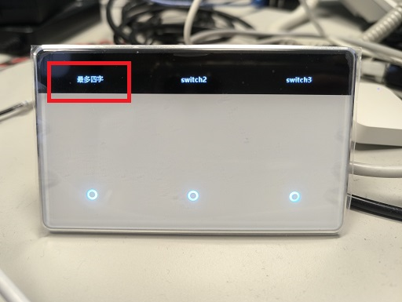
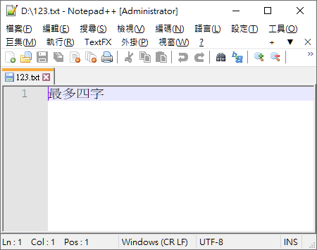

[🧾去選單](../../README.md)

> 發布於: 2025/5/21

# 居家Zigbee系列：可自訂名稱的酷炫台灣零火開關

## 快速總結

Zemismart推出很酷的觸控型開關

- 每個按鍵可以自訂文字（中文最多4字、英文最多10字）
- 觸控型玻璃面板
- 零火版（必須要中性線）
- Z2M支援（v2.3.0含以上）
- 官方售價`NT$866`～`NT$999`

## 👍 優點

### 高品質外觀

黃銅接點、金屬外框、玻璃面板

如同精品一般的存在

目前遇過最精緻的外觀

### 自訂文字

每個按鍵可以動態更改顯示文字

也能支援簡體/繁體中文

每個按鍵支援中文最多4個字

英文則可以輸入10個字

### 多鍵觸發處理

在四鍵版本中，測試同時按下四個按鍵都能同時觸發

並且在超快速切換開關狀態時，也處理得非常完美

> 注意！大部分智能開關做不到以上兩點

https://github.com/user-attachments/assets/94ce0dae-91bb-4ce7-8cdc-2e5ae7311e92

### 自動省電模式

此款產品內建人體感應器

有人接近時才會亮起螢幕及指示燈

不動約10秒左右會熄滅指示燈省電

### 可調指示燈顏色及亮度

可針對開燈、關燈分別設定指示燈顏色

固定顏色選項為：白、藍、綠、黃、紅、粉

> 以上設定會同時套用到所有按鍵，無法每個按鍵個別設置

### 優化的產品厚度

實測此款入牆厚度約為2.5cm（規格寫2.3cm）

在智能開關中算是比較薄的類型

可能更容易的塞入牆壁暗盒中

> 注意！還是比傳統開關厚很多，請確認自家環境的可用深度

## 👎 缺點

### 高貴價格

官方售價不同鍵數售價換算台幣約NT$866～NT$999

是我目前購買的所有牆壁開關最貴的

### Z2M支援尚不完整

Z2M新版本`v2.3.0`支援雙鍵、三鍵、四鍵版本

但尚**不支援單鍵版**

單鍵版需要自己拿其他鍵的內容來生成**外部轉換器**

對非專業玩家來說難度很高

另外Z2M部分參數設定會跳出錯誤訊息

但目前沒發現會嚴重影響到實際使用的錯誤

至少顏色、亮度、文字都能正常設置

### Z2M無法支援繁體中文（有解法）

在Z2M設定按鍵文字為中文

開關螢幕上實際會出現亂碼

有兩種方法解決，請參考[下文](#中文亂碼解決方案)

### 文字螢幕刷新慢

每個按鍵都有獨立的顯示螢幕

但是切換狀態時會有明顯的刷新

快速切換時會有延遲（正常情況下不會這麼高速切換）

從`多鍵觸發`的影片可以看到這個問題

https://github.com/user-attachments/assets/94ce0dae-91bb-4ce7-8cdc-2e5ae7311e92

### 自動省電無法取消

目前10秒關閉指示燈及文字是強制性功能

並且沒有對應的參數可供調整

後續不確定能不能透過韌體開放支援

### 沒有解藕模式

沒辦法設定繼電器分離

如果要給智慧燈泡長期供電要自己接線

## 🏪 商店

[現貨商品](https://myship.7-11.com.tw/general/detail/GM2406268597737)

手上備品只有兩個，分別是垂直款四鍵、水平款三鍵

## 功能介紹及硬體拆解

請直接參考國外網站Smart Home Scene的文章[點我前往](https://smarthomescene.com/reviews/zemismart-zigbee-screen-switch-zms-206-review/)

國外文章評測很詳細，軟硬體部分這邊就不做重複介紹了

此款有分86型（歐洲/中國）與118型（美國/台灣）

只有外觀不同，硬體及軟體則是完全相同

## 中文亂碼解決方案

Z2M在設定按鍵名稱時不支援中文

但可以透過兩種方法設定中文

1. [接入塗鴉平台設定](#先接入塗鴉平台設定需要塗鴉網關)
1. [編碼轉換](#透過iso-8859-1編碼轉換)

### 先接入塗鴉平台設定（需要塗鴉網關）

在塗鴉平台透過Smart Life APP可以正常使用全功能

並且也能為按鍵文字輸入繁體中文

設定完成後再重新接入Z2M當中使用

重新配對不會導致之前的設定被重置

但是你必須有個塗鴉Zigbee網關

### 透過ISO-8859-1編碼轉換

經過長時間的測試與研究

發現可以通過編碼ISO-8859-1（又稱latin-1）實現中文設定

流程如下：

1. 建立一個文字檔
1. 將編碼切為`UTF-8`
1. 輸入中文名稱（最多4字）
1. 將編碼切成`ISO-8859-1`
1. 完整複製內容並貼到Z2M設定
1. 下一組文字轉換，從切為`UTF-8`開始重複以上流程

以下測試幾種文字編輯器可支援編碼轉換

- [Notepad++](https://notepad-plus-plus.org/downloads/v8.8.1/)（PC）
- [Visual Studio Code](https://code.visualstudio.com/download)（PC）
- [QuickEdit](https://play.google.com/store/apps/details?id=com.rhmsoft.edit&hl=zh_TW)（Android）

### Notepad++操作範例（Win10）

建立一個123.txt並輸入中文

按照下圖操作去選擇ISO-8859-1

> 編碼→字元集→西歐語系→ISO 8859-1

全選並複製轉換後的拉丁文

在Z2M的按鍵名稱貼上拉丁文

滑鼠點一下輸入框以外的地方以套用設定

大功告成！

### VSCode操作範例（Win10）

建立一個123.txt並輸入中文

按照下圖操作去選擇ISO-8859-1

> UTF-8（右下角）→以編碼重新開啟→Western(ISO 8859-1)

全選並複製轉換後的拉丁文

在Z2M的按鍵名稱貼上拉丁文

滑鼠點一下輸入框以外的地方以套用設定

大功告成！

### 注意事項

- `ISO-8859-1`又稱`latin-1`，編碼中找到兩者之一都可以
- 如果編碼有做地區分類，試著尋找`西歐語系`
- **不要使用線上網頁轉換器**，因網頁HTML可能會無法保留原始的latin-1內容

## 其他建議

### 購買型號選擇

注意有分`水平款`、`垂直款`

台灣開關一般安裝是`橫向`的（對應`水平款`）

Z2M `v2.3.0`支援雙鍵、三鍵、四鍵

> 目前尚不支援單鍵版

盡量購買雙鍵以上的版本

按鍵是多多益善，可以連動其他空間的開關

例如玄關也可以加入`客廳`、`全室一鍵開關`等功能

### 指示燈亮度與顏色

提供個人目前認為最舒服的設定

關閉顏色為`白色`

開啟顏色為`藍色`或`綠色`

指示燈亮度設定`5%`

> 指示燈真的不用太亮，看的到位置即可

## Zemismart官方賣場

- [水平款（1~4鍵）](https://www.zemismart.com/products/zms-206us-1-h)
- [垂直款（1~4鍵）](https://www.zemismart.com/products/zms-206us)

目前官方售價（僅供參考）

- 單鍵：US$28.86（約NT$866）
- 雙鍵：US$30.36（約NT$911）
- 三鍵：US$31.82（約NT$955）
- 四鍵：US$33.30（約NT$999）

> 官方賣場到台灣似乎是免運，但個人是習慣先送到大陸集運倉再走私人集運回台

撰寫此文時，廠家說淘寶官方尚未上架此產品

如果從淘寶其他第三方賣場購買可能更便宜

各位可自行評估風險

## 免責聲明

本貼文沒有任何業配或推坑，純粹是個人經驗分享，高CP值的產品可能因為生產公差、用料、審美、個人運氣等因素導致每個人商品體驗不同，請謹慎評估後購買。

[🧾去選單](../../README.md)