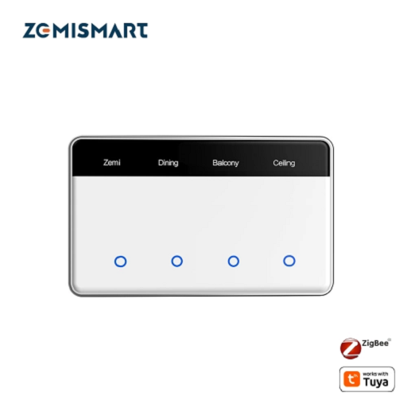
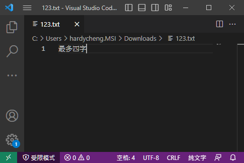

[🧾去選單](../../README.md)

> 發布於: 2025/5/22

# 居家Zigbee系列：可自訂名稱的酷炫台灣零火開關



## 目錄

- [快速總結](#快速總結)
- [優點](#-優點)
- [缺點](#-缺點)
- [商店](#-商店)
- [功能介紹及硬體拆解](#功能介紹及硬體拆解)
- [中文亂碼解決方案](#中文亂碼解決方案)
- [Z2M單鍵版的外部轉換器](#自訂外部轉換器)
- [其他建議](#其他建議)
- [官方賣場](#zemismart官方賣場)

## 快速總結

Zemismart推出很酷的觸控型開關

- 每個按鍵可以自訂文字（中文最多4字、英文最多10字）
- 開關指示燈顏色及亮度可調
- 觸控型玻璃面板
- 零火版（必須要中性線）
- Z2M支援（v2.3.0含以上）
- 官方售價`NT$639`～`NT$756`（2025/6/3天貓價格）

## 👍 優點

### 高品質外觀

黃銅接點、金屬外框、玻璃面板

如同精品一般的存在

目前遇過最精緻的外觀

### 自訂文字

每個按鍵可以動態更改顯示文字

也能支援簡體/繁體中文

每個按鍵支援中文最多4個字

英文則可以輸入10個字


### 多鍵觸發處理

在四鍵版本中，測試同時按下四個按鍵都能同時觸發

並且在超快速切換開關狀態時，也處理得非常完美

> 注意！大部分智能開關做不到以上兩點

https://github.com/user-attachments/assets/b39d16c5-231a-4574-9977-8a1fb93114c6

> 名稱面板的低成本螢幕在攝影時有頻閃是正常現象，人類視覺上不會閃爍

### 自動省電模式

此款產品內建人體感應器

有人接近時才會亮起螢幕及指示燈

不動約10秒左右會熄滅指示燈省電

### 可調指示燈顏色及亮度

可針對開燈、關燈分別設定指示燈顏色

固定顏色選項為：白、藍、綠、黃、紅、粉

> 以上設定會同時套用到所有按鍵，無法每個按鍵個別設置

### 優化的產品厚度

實測此款入牆厚度約為2.5cm（規格寫2.3cm）

在智能開關中算是比較薄的類型

可能更容易的塞入牆壁暗盒中

> 注意！還是比傳統開關厚很多，請確認自家環境的可用深度

## 👎 缺點

### 高貴價格

[官方賣場](https://www.zemismart.com/products/zms-206us-1-h)不同鍵數售價換算台幣約NT$866～NT$999

[天貓賣場](https://detail.tmall.com/item.htm?id=886920065912)不同鍵數售價換算台幣約NT$639～NT$756

是我目前購買的所有牆壁開關最貴的

> 跟台灣廠商的塗鴉Zigbee開關比起來還是小錢啦...

### Z2M支援尚不完整

Z2M新版本`v2.3.0`支援雙鍵、三鍵、四鍵版本

但尚**不支援單鍵版**

單鍵版需要自己拿其他鍵的內容來生成**外部轉換器**

對非專業玩家來說難度很高

**（2025/6/3更新）**

目前已經完成單鍵版外部轉換器開發，請至[單鍵版的外部轉換器](#自訂外部轉換器)查看

另外Z2M部分參數設定會跳出錯誤訊息

但目前沒發現會嚴重影響到實際使用的錯誤

至少顏色、亮度、文字都能正常設置

### Z2M無法支援繁體中文（有解法）

在Z2M設定按鍵文字為中文

開關螢幕上實際會出現亂碼

有兩種方法解決，請參考[下文](#中文亂碼解決方案)

### 文字螢幕刷新慢

每個按鍵都有獨立的顯示螢幕

但是切換狀態時會有明顯的刷新

快速切換時會有延遲（正常情況下不會這麼高速切換）

從`多鍵觸發`的影片可以看到這個問題

https://github.com/user-attachments/assets/b39d16c5-231a-4574-9977-8a1fb93114c6

### 自動省電無法取消

目前10秒關閉指示燈及文字是強制性功能

並且沒有對應的參數可供調整

後續不確定能不能透過韌體開放支援

### 沒有解藕模式

沒辦法設定繼電器分離

如果要給智慧燈泡長期供電要自己接線

## 🏪 商店

[現貨商品](https://myship.7-11.com.tw/general/detail/GM2406268597737)

### 2025/6/3更新 

目前無現貨，天貓官方上架便宜很多，建議各位自行購入

## 功能介紹及硬體拆解

請直接參考國外網站Smart Home Scene的文章[點我前往](https://smarthomescene.com/reviews/zemismart-zigbee-screen-switch-zms-206-review/)

國外文章評測很詳細，軟硬體部分這邊就不做重複介紹了

此款有分86型（歐洲/中國）與118型（美國/台灣）

只有外觀不同，硬體及軟體則是完全相同

以下圖片來源與說明參考自[SmartHomeScene 原文](https://smarthomescene.com/reviews/zemismart-zigbee-screen-switch-zms-206-review/)（86型規格）

### 產品正面

產品正面為玻璃面板設計，觸控按鍵搭配黑色顯示螢幕


### 產品背面

背面標示接線端子與規格資訊


### 拆下面板

拆下外框後可見內部結構，按鍵採用觸摸電容


### 內部主機板

整體分為兩塊電路板，透過排針連接


### 繼電器與電源模組

電源模組看起來很不錯，也是產品整體厚度的主因


### 雷達感應器

內建`HLK-LD1020`雷達模組，靠近時自動喚醒螢幕與指示燈，達到省電目的


## 中文亂碼解決方案

Z2M在設定按鍵名稱時不支援中文

但可以透過兩種方法設定中文

1. [接入塗鴉平台設定](#先接入塗鴉平台設定需要塗鴉網關)
1. [編碼轉換](#透過iso-8859-1編碼轉換)

### 先接入塗鴉平台設定（需要塗鴉網關）

在塗鴉平台透過Smart Life APP可以正常使用全功能

並且也能為按鍵文字輸入繁體中文

設定完成後再重新接入Z2M當中使用

重新配對不會導致之前的設定被重置

但是你必須有個塗鴉Zigbee網關

### 透過ISO-8859-1編碼轉換

經過長時間的測試與研究

發現可以通過編碼ISO-8859-1（又稱latin-1）實現中文設定

流程如下：

1. 建立一個文字檔
1. 將編碼切為`UTF-8`
1. 輸入中文名稱（最多4字）
1. 將編碼切成`ISO-8859-1`
1. 完整複製內容並貼到Z2M設定
1. 下一組文字轉換，從切為`UTF-8`開始重複以上流程

以下測試幾種文字編輯器可支援編碼轉換

- [Notepad++](https://notepad-plus-plus.org/downloads/v8.8.1/)（PC）
- [Visual Studio Code](https://code.visualstudio.com/download)（PC）
- [QuickEdit](https://play.google.com/store/apps/details?id=com.rhmsoft.edit&hl=zh_TW)（Android）

### Notepad++操作範例（Win10）

建立一個123.txt並輸入中文


按照下圖操作去選擇ISO-8859-1

> 編碼→字元集→西歐語系→ISO 8859-1


全選並複製轉換後的拉丁文


在Z2M的按鍵名稱貼上拉丁文

滑鼠點一下輸入框以外的地方以套用設定


大功告成！


### VSCode操作範例（Win10）

建立一個123.txt並輸入中文



按照下圖操作去選擇ISO-8859-1

> UTF-8（右下角）→以編碼重新開啟→Western(ISO 8859-1)


全選並複製轉換後的拉丁文


在Z2M的按鍵名稱貼上拉丁文

滑鼠點一下輸入框以外的地方以套用設定


大功告成！


### 注意事項

- `ISO-8859-1`又稱`latin-1`，編碼中找到兩者之一都可以
- 如果編碼有做地區分類，試著尋找`西歐語系`
- **不要使用線上網頁轉換器**，因網頁HTML可能會無法保留原始的latin-1內容

## 自訂外部轉換器

**（2025/6/9更新）**

截至目前`Z2M v2.3.0`仍**不支援**這款`一路（或稱單鍵）版本`的開關

哈迪自己做了外部轉換器並測試可用

免費提供給各位做使用

本人不負責任何技術諮詢及軟硬體異常排查

夥伴們可閱讀以下步驟後再決定是否實施

### Z2M環境

- Home Assistant Core `2025.5.3`
- Zigbee2mqtt `v2.3.0-1`（附加元件）
- HACS `v2.0.5`（非必要）

### 升級Z2M

請先將Z2M升級到`v2.3.0或以上`版本

> 注意！升級前請做好備份。如果是舊版v1.x.x升級到v2.x.x，要有不相容的心理準備

> 另外HA核心太舊也可能導致Z2M附加元件無法升級

### 上傳圖片（非必要）

上傳一路版本專用圖片

> 此步驟非必要，可以跳過到[下個步驟](#上傳外部轉換器)

以任何方式保存以下圖片


透過任何方式將圖片上傳至HA主機中

以下是外部轉換器目前預設的HACS檔案路徑

> 提示：`www`資料夾會跟`custom_components`在同一層目錄下

```
(你的HA根目錄)/www/community/images/ZMS-206US-1.jpg
```

如果你的HA環境沒有架設FTP伺服器，也無法使用ssh連線

那麼可以使用HA側邊選單中內建的`File editor`去建立路徑及上傳圖片

> 注意！資料夾及圖片檔案名稱必須一模一樣，小心錯別字！

### 上傳外部轉換器

> Z2M升級到v2.x.x才能使用以下外部轉換器方法

下載或複製以下程式碼

> 檔案連結、純文字連結，擇一使用

- 檔案連結：[ZMS-206US-1.js](https://github.com/hardycheng-github/smarthome-blog/blob/main/blog/zigbee/external_converters/homeassistant/zigbee2mqtt/external_converters/ZMS-206US-1.js)
- 純文字連結：[ZMS-206US-1.js](https://raw.githubusercontent.com/hardycheng-github/smarthome-blog/refs/heads/main/blog/zigbee/external_converters/homeassistant/zigbee2mqtt/external_converters/ZMS-206US-1.js)

建立以下路徑檔案並貼上程式碼

如果你是使用HA附加元件安裝Z2M，遵循以下路徑

> 提示：`zigbee2mqtt`資料夾會跟`custom_components`在同一層目錄下

```
(你的HA根目錄)/zigbee2mqtt/external_converters/ZMS-206US-1.js
```

如果是透過其他方法安裝Z2M，遵循以下路徑

```
(你的Z2M根目錄)/external_converters/ZMS-206US-1.js
```

> 注意！資料夾及程式碼檔案名稱必須一模一樣，小心錯別字！

圖片路徑上傳至自定義位置的，請自行修改程式碼中的圖片路徑

如果是按照上述HACS路徑上傳，或未上傳圖片的則略過

```
[59行] icon: '/hacsfiles/images/ZMS-206US-1.jpg?',
```

檔案後綴加上`?`可以讓HA強制重載該檔案，避免圖片更換後UI顯示舊圖的問題

每次更換圖片後可以使用`?`+`不同數字`去強制重載資源，例如以下

```
icon: '/hacsfiles/images/ZMS-206US-1.jpg?99',
```

### 重啟Z2M並觀察日誌

上述步驟完成後，請重新啟動Zigbee2mqtt

如果是透過附加元件安裝的請遵循以下

> 重啟Z2M需要時間，請耐心等候，直到Z2M操作介面可正常使用

```
設定→附加元件→Zigbee2mqtt→重啟
```


重新啟動Z2M後建議前往同頁面右上角的`日誌`

並輸入關鍵字`206US`觀察


過段時間後應該出現**正確訊息**如下

```
[2025-06-09 16:38:25] info: 	z2m: Loaded external converter 'ZMS-206US-1.js'.
```

**程式碼格式有誤**會出現類似以下訊息，請確認你的程式碼內容排版

> 注意！格式錯誤的外部轉換器副檔名會被改成`.invalid`，修改好內容後記得重新命名成`.js`，再重啟Z2M

```
[2025-06-09 16:40:57] error: 	z2m: Invalid external converter 'ZMS-206US-1.js' was ignored and renamed to prevent interference with Zigbee2MQTT.
```

**找不到外部轉換器**則不會出現任何訊息，請確認上傳檔案路徑及檔案讀取權限

### 配對資訊

將你的一路開關配對至Z2M後

正常情況下你會看到如下資訊


公開控制項目如下

> 移除了個人認為無用的功能：按鍵倒計時


如果你發現裝置仍然是未支援的狀態

查看一下`Zigbee製造商`名稱是否為`_TZE204_sa2ueffe`或`_TZE284_sa2ueffe`

如果不是，請自行修改外部轉換器`ZMS-206US-1.js`內容如下

```
[60行] fingerprint: tuya.fingerprint("TS0601", ["_TZE204_sa2ueffe", "_TZE284_sa2ueffe"]),
```

在最後列表中加入你的製造商名稱（假設是`_ABC204_aabbccdd`）

```
[60行] fingerprint: tuya.fingerprint("TS0601", ["_TZE204_sa2ueffe", "_TZE284_sa2ueffe", "_ABC204_aabbccdd"]),
```

> 注意！程式碼的排版格式很重要，請嚴格按照規則

修改好之後再重新啟動Z2M並查看裝置是否支援

### 恭喜完成外部轉換器！

你成功完成了超困難的Z2M自訂外部轉換器

趕快去跟親朋好友炫耀一下

## 其他建議

### 購買型號選擇

注意有分`水平款`、`垂直款`

台灣開關一般安裝是`橫向`的（對應`水平款`）

Z2M `v2.3.0`支援雙鍵、三鍵、四鍵

> 目前尚不支援單鍵版

盡量購買雙鍵以上的版本

按鍵是多多益善，可以連動其他空間的開關

例如玄關也可以加入`客廳`、`全室一鍵開關`等功能

### 指示燈亮度與顏色

提供個人目前認為最舒服的設定

關閉顏色為`白色`

開啟顏色為`藍色`或`綠色`

指示燈亮度設定`5%`

> 指示燈真的不用太亮，看的到位置即可

## Zemismart官方賣場

- [水平款（1~4鍵）](https://www.zemismart.com/products/zms-206us-1-h)
- [垂直款（1~4鍵）](https://www.zemismart.com/products/zms-206us)

目前官方售價（僅供參考）

- 單鍵：US$28.86（約NT$866）
- 雙鍵：US$30.36（約NT$911）
- 三鍵：US$31.82（約NT$955）
- 四鍵：US$33.30（約NT$999）

> 官方賣場到台灣似乎是免運，但個人是習慣先送到大陸集運倉再走私人集運回台

**（2025/6/3更新）**

目前天貓商城「[zemismart智能家居旗艦店](https://detail.tmall.com/item.htm?id=886920065912)」已上架此產品，定價如下：

- 單鍵：人民幣¥142（約NT$639）
- 雙鍵：人民幣¥151（約NT$680）
- 三鍵：人民幣¥159（約NT$716）
- 四鍵：人民幣¥168（約NT$756）

> 請注意！淘寶預設出貨為`垂直款`，台灣慣用的`水平款`需要在下單時**特別備註寫「橫裝」**，並建議再三與客服確認是否能出貨`橫裝的`

如果從淘寶其他第三方賣場購買可能更便宜

至於是否為盜版貨源，或是買到客退品、整新品

各位可自行評估風險

## 免責聲明

本貼文沒有任何業配或推坑，純粹是個人經驗分享，高CP值的產品可能因為生產公差、用料、審美、個人運氣等因素導致每個人商品體驗不同，請謹慎評估後購買。

[🧾去選單](../../README.md)
